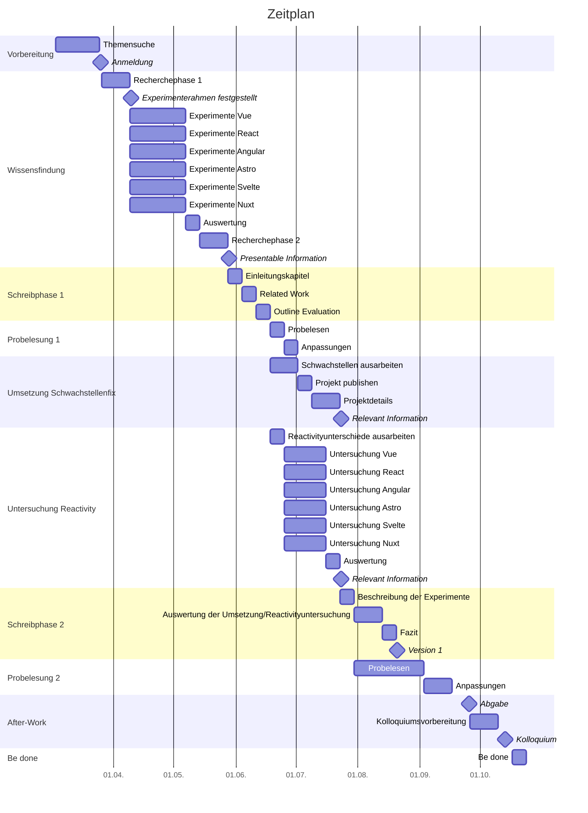

<h1>Masterthesis Zeitplan</h1>

- [Gantt](#gantt)
- [Milestones](#milestones)
  - [1. Anmeldung](#1-anmeldung)
  - [2. Experimenterahmen festgestellt](#2-experimenterahmen-festgestellt)
  - [3. Presentable Information](#3-presentable-information)
  - [4. Relevant Information](#4-relevant-information)
  - [5. Version 1](#5-version-1)
  - [6. Abgabe](#6-abgabe)
  - [6. Kolloquium](#6-kolloquium)

# Gantt

# Milestones

## 1. Anmeldung

|               |                                                                     |
| ------------- | ------------------------------------------------------------------- |
| Beschreibung  | Anmeldung der Abschlussarbeit                                       |
| Predicted ETA | 25.03.24                                                            |
| Actual TA     | 25.03.24                                                            |
| Anforderung   | Anmeldung der Abschlussarbeit von der Prüfungsverwaltung genehmigt. |

## 2. Experimenterahmen festgestellt

|               |                                                                                                                                                                            |
| ------------- | -------------------------------------------------------------------------------------------------------------------------------------------------------------------------- |
| Beschreibung  | Um einen geordneten und zielgerichteten Ablauf der ersten Experimente zu gewährleisten, müssen Rahmenbedingungen, Untersuchungsgegenstände und Metriken festgelegt werden. |
| Predicted ETA | 08.04.24                                                                                                                                                                   |
| Actual TA     |                                                                                                                                                                            |
| Anforderung   | Untersuchte Frameworks, genutzte Metriken, Experimenteumgebung und Experimentebeschreibung stehen fest.                                                                    |

## 3. Presentable Information

|               |                                                                                                                                                                     |
| ------------- | ------------------------------------------------------------------------------------------------------------------------------------------------------------------- |
| Beschreibung  | Nach Durchführung der ersten Experimente gibt es erste Erkenntnisse, die vorgestellt und verglichen werden können, damit sie besprochen und bewertet werden können. |
| Predicted ETA | 27.05.24                                                                                                                                                            |
| Actual TA     |                                                                                                                                                                     |
| Anforderung   | Experimenteergebnisse sind verständlich, vollständig und vergleichbar dokumentiert.                                                                                 |

## 4. Relevant Information

|               |                                                                                                                                                                                                                                                                                                                                                      |
| ------------- | ---------------------------------------------------------------------------------------------------------------------------------------------------------------------------------------------------------------------------------------------------------------------------------------------------------------------------------------------------- |
| Beschreibung  | Nach der ersten Experimentephase wurden in einer zweiten Wissensfindungsphase die Ergebnisse der ersten Experimente im Detail hinterfragt und genauer untersucht, um Erkenntnisse daraus zu ziehen. Dies kann entweder die Behebung von gefundenen Schwachstellen oder die genauere Untersuchung der Performance der JavaScript-Frameworks bedeuten. |
| Predicted ETA | 01.07.24                                                                                                                                                                                                                                                                                                                                             |
| Actual TA     |                                                                                                                                                                                                                                                                                                                                                      |
| Anforderung   | Es wurden entweder Schwachstellenfixes aus den ersten Experimenten oder Performancevariablen aus den ersten Experimenten verständlich, vollständig und vergleichbar dokumentiert.                                                                                                                                                                    |

## 5. Version 1

|               |                                                                                                                                                         |
| ------------- | ------------------------------------------------------------------------------------------------------------------------------------------------------- |
| Beschreibung  | Die erste vollständige Version der Arbeit ist fertig und kann zum Probelesen freigegeben werden. Jetzt sollten nur noch Details und Abbildungen fehlen. |
| Predicted ETA | 29.07.24                                                                                                                                                |
| Actual TA     |                                                                                                                                                         |
| Anforderung   | Alle vorgesehenen Kapitel sind textuell vollständig und auf Rechtschreibfehler geprüft. Darstellungen, Diagramme, Screenshots etc. dürfen fehlen.       |

## 6. Abgabe

|               |                                                                                                                                                                           |
| ------------- | ------------------------------------------------------------------------------------------------------------------------------------------------------------------------- |
| Beschreibung  | Deadline für die Abgabe der Arbeit.                                                                                                                                       |
| Predicted ETA | 25.09.24                                                                                                                                                                  |
| Actual TA     |                                                                                                                                                                           |
| Anforderung   | Die Arbeit ist Probegelesen (und korrigiert), auf Rechtschreibfehler geprüft, ggf. ausgedruckt und gebunden, und auf Datenträgern bei der Prüfungsverwaltung eingegangen. |

## 6. Kolloquium

|               |                                                                                                                                                                     |
| ------------- | ------------------------------------------------------------------------------------------------------------------------------------------------------------------- |
| Beschreibung  | Präsentation und Verteidung der Ergebnisse der Arbeit.                                                                                                              |
| Predicted ETA | 09.10.24                                                                                                                                                            |
| Actual TA     |                                                                                                                                                                     |
| Anforderung   | Präsentation ist im PDF-Format exportiert, hochgeladen und auf USB-Stick gespeichert und die Präsentation ist geprobt und auf den geforderten Zeitrahmen angepasst. |