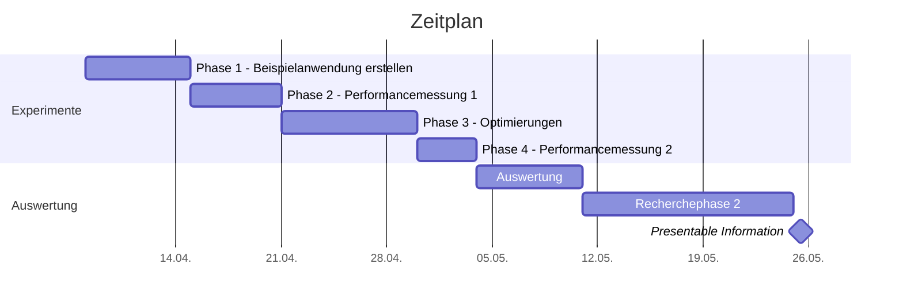

<h1>Experimentenplan 08.04.2024</h1>

- [Zeitplan](#zeitplan)
- [Fragestellung](#fragestellung)
- [Methodik / Vorgehensweise](#methodik--vorgehensweise)
- [Untersuchungsgegenstand / JS-Frameworks](#untersuchungsgegenstand--js-frameworks)
- [Metriken](#metriken)

# Zeitplan

# Fragestellung

1. Wie gut performen Webseiten, die mit unterschiedlichen JS-Frameworks erstellt worden sind?
2. Wie effektiv sind klassische und generelle Optimierungsansätze mit den JS-Frameworks und wie einfach sind sie umzusetzen?

# Methodik / Vorgehensweise

1. Erstellung der gleichen Anwendung mit mehreren JS-Frameworks (s. unten)
   1. Einarbeitung in Methoden und Praktiken des Frameworks
   2. Einhaltung und Umsetzung der Stärken des Framworks
   3. Nutzung der Core-Objekte für HTML (HTML- , JS-, CSS- und Multimediaobjekte)
2. Messung der Performance der erstellten Webseiten
   1. Allgemeingültige Metriken für Webperformance (s. unten)
   2. Erstellung einer vergleichbaren Umgebung
3. Umsetzung von klassischen HTML-Optimierungen mit allen JS-Frameworks
   1. Bildoptimierungen: Responsive Images, Lazy Loading
   2. JS-Optimierung: Tree Shaking, Minification, Concatenation, Deferred Loading
   3. CSS-Optimierung: Tree Shaking, Minification, Deferred Loading
   4. Un-chaining Ressources
   5. Prerendering HTML
4. Messung der Performance der optimierten Webseiten
5. (Vergleichsmessung mit häufig besuchten Webseiten im Internet)

# Untersuchungsgegenstand / JS-Frameworks

1. SPAs
   1. Vue
   2. React
   3. Angular
   4. Svelte
2. MPAs
   1. Astro
   2. Nuxt
   3. Next
3. Optional
   1. (Solid)
   2. (Qwik)

*gewählt nach den Reports [State of JS 2022](https://2022.stateofjs.com/en-US/libraries/front-end-frameworks/) und [Core Web Vitals Technology Report](https://lookerstudio.google.com/u/0/reporting/55bc8fad-44c2-4280-aa0b-5f3f0cd3d2be/page/M6ZPC?params=%7B%22df46%22:%22include%25EE%2580%25800%25EE%2580%2580IN%25EE%2580%2580mobile%22,%22df44%22:%22include%25EE%2580%25800%25EE%2580%2580IN%25EE%2580%2580React%25EE%2580%2580Vue.js%25EE%2580%2580AngularJS%25EE%2580%2580Angular%25EE%2580%2580Nuxt.js%25EE%2580%2580Svelte%25EE%2580%2580Astro%22,%22df48%22:%22include%25EE%2580%25800%25EE%2580%2580IN%25EE%2580%2580Nginx%22%7D)*

# Metriken

1. Page Load Time (PLT)
   1. Total
   2. Networking (Redirects, *DNS*, *TCP*, Request + Response)
   3. Rendering (Processing, OnLoad)
2. Total Page Size (TPS)
3. Number of Requests (NoR)
4. Lighthouse/Web Vitals Performance Score
   1. Largest Contentful Paint (LCP)
   2. Total Blocking Time (TBT)
   3. First Contentful Paint (FCP)
   4. Cummulative Layout Shift (CLS)
   5. Time to first byte (TTFB)