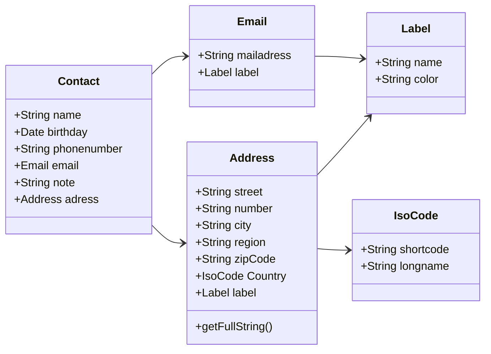
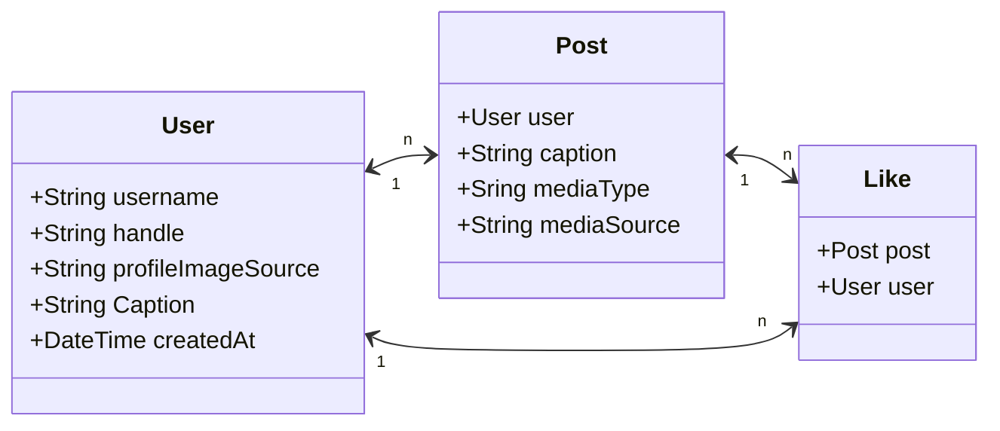

<h1>Entwurf der Beispielanwendung 11.04.2024</h1>

- [Anforderungen](#anforderungen)
- [Vorschläge](#vorschläge)
  - [01: Kontaktlisten-App](#01-kontaktlisten-app)
    - [Beschreibung](#beschreibung)
    - [Vorteile](#vorteile)
    - [Abstriche](#abstriche)
  - [02: Instagram-Klon](#02-instagram-klon)
    - [Beschreibung](#beschreibung-1)
    - [Vorteile](#vorteile-1)
    - [Abstriche](#abstriche-1)

# Anforderungen

1. Die Anwendung muss alle modernen HTML5 Elementrubriken abdecken.
   1. HTML
   2. CSS
   3. JS
   4. Multimedia-Objekte
2. Die Anwendung muss moderene Development-Praktiken beinhalten.
   1. Routing
   2. Wiederverwendbare Komponenten/Module
3. Die Anwendung soll "herausfordernde" Optimierungsprobleme beinhalten.
   1. Externe Ressourcen (Fonts, Bilder, JS usw.)
   2. Große, un-optimierte Multimedia-Dateien
   3. Nested Objects

# Vorschläge
✅ = umsetzbar
⚠️ = mit Aufwand umsetzbar
❌ = nicht oder nur sehr umständlich umsetzbar

| Anforderung               | Vorschlag 01: Kontaktlisten-App | Vorschlag 02: Instagram-Klon |
| ------------------------- | :-----------------------------: | :--------------------------: |
| **1 HTML5-Elemente**      |                ✅                |              ✅               |
| 1.1 HTML                  |                ✅                |              ✅               |
| 1.2 CSS                   |                ✅                |              ✅               |
| 1.3 JS                    |                ✅                |              ✅               |
| 1.4 Multimedia            |                ✅                |              ✅               |
| **2 Dev-Praktiken**       |                ✅                |              ✅               |
| 2.1 Routing               |                ✅                |              ✅               |
| 2.2 Komponenten           |                ✅                |              ✅               |
| **3 Optimierunsprobleme** |                ✅                |              ✅               |
| 3.1 Externe Ressourcen    |                ✅                |              ✅               |
| 3.2 Image Compression     |                ✅                |              ✅               |
| 3.3 Nested Objects        |                ✅                |              ✅               |

## 01: Kontaktlisten-App

### Beschreibung
Mit der Kontaktlisten-App soll der Anwender seine Kontakte speichern und verwalten können. Dazu soll es dem Anwender möglich sein, alle Kontaktdaten wie beispielsweise Telefonnummern, E-Mail-Adressen, Heimatadressen etc. zu speichern und mit Labels zu versehen.

Der Anwender soll Kontakte erstellen, bearbeiten und löschen können. Gespeicherte Kontakte sollen in Listen dargestellt, durchsucht und sortiert werden können.

Optional:
- Verwandtschaftsbeziehungen zwischen den Kontakten

Seiten/Pages:
1. Telefonbuch-Seite: Menü, "Neuer Kontakt"-Button, Kontaktliste und Filter- und Sortierungsmenü
2. Kontakt-Detailansicht
3. "Neuer Kontakt"-Seite: Ausfüllformular zum Neuanlegen/Bearbeiten eines Kontakts
4. Info-Seite: Informationen zur Funktion, Technik und zum Ersteller der Seite

### Vorteile

1. Simpel zu verstehen, was die Anwendung machen soll
2. Seitenübergreifende Informationen (State)
3. Anbindung an externe Ressourcen über UI-Frameworks oder Icons möglich
4. Nutzung von Profilbildern (in unterschiedlichen Größen) und Hintergrundbildern

### Abstriche

1. Umsetzung der Datenstruktur ggf. umständlich
2. Sinnhaftigkeit und Realismus der Anwendung sind fraglich.
3. Keine Bewegtbilder

## 02: Instagram-Klon

### Beschreibung
Im Instagram-Klon kann der Anwender Eindrücke und Gedanken in Bildform teilen und an den visuellen Eindrücken seiner Bekannten teilhaben. Nebst der Feed-Funktion wie sie vom Original bekannt sind, können in Profilansichten persönliche Informationen geteilt werden.

Seiten/Pages:
1. Feed-Seite mit den neuesten Posts und Profileliste
2. "Beitrag erstellen"-Seite mit Formular und Preview
3. "Profil erstellen"-Seite mit Formular und Preview
4. Info-Seite: Informationen zur Funktion, Technik und zum Ersteller der Seite

### Vorteile

1. Simpel zu verstehen, was die Anwendung machen soll
1. Bilder und Bewegtbilder können genutzt werden.
2. Performance von Bildern im falschen Seitenverhältnis können gemessen werden.

### Abstriche

1. Keine Seitenübergreifende Informationen (State)