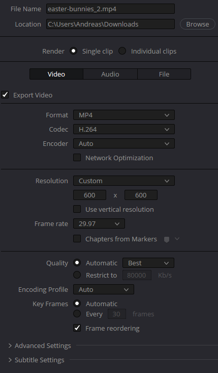
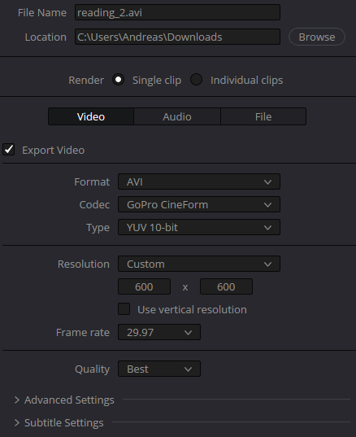

# Video Sizes

| Video              | Original | Resolution-matched MP4 |  60%-MP4 | 10%-MP4 |   60%-AVI |  10%-AVI |
| ------------------ | -------: | ---------------------: | -------: | ------: | --------: | -------: |
| canyon.mp4         |  6884 kB |                7525 kB |  6130 kB |  894 kB |  44167 kB |  7172 kB |
| reading.mp4        |  6436 kB |                7525 kB |  3999 kB |  521 kB |  47723 kB |  7850 kB |
| beach.mp4          | 58957 kB |               72051 kB | 39542 kB | 6191 kB | 179912 kB | 29312 kB |
| skaters.mp4        |  5914 kB |               11887 kB |  6551 kB | 1100 kB |  30377 kB |  5019 kB |
| easter-bunnies.mp4 |  3307 kB |                4624 kB |  2450 kB |  380 kB |  35929 kB |  8187 kB |

| Video              | Original | Resolution-matched MP4 |  60%-MP4 | 10%-MP4 |   60%-AVI |  10%-AVI |
| ------------------ | -------: | ---------------------: | -------: | ------: | --------: | -------: |
| canyon.mp4         |    100 % |               109,31 % |  89,04 % | 12,99 % |  641,59 % | 104,18 % |
| reading.mp4        |    100 % |               116,92 % |  62,13 % |  8,10 % |  741,50 % | 121,97 % |
| beach.mp4          |    100 % |               122,21 % |  67,07 % | 10,50 % |  305,16 % |  49,72 % |
| skaters.mp4        |    100 % |               201,00 % | 110,77 % | 18,60 % |  513,65 % |  84,87 % |
| easter-bunnies.mp4 |    100 % |               139,82 % |  74,09 % | 11,49 % | 1086,45 % | 247,59 % |