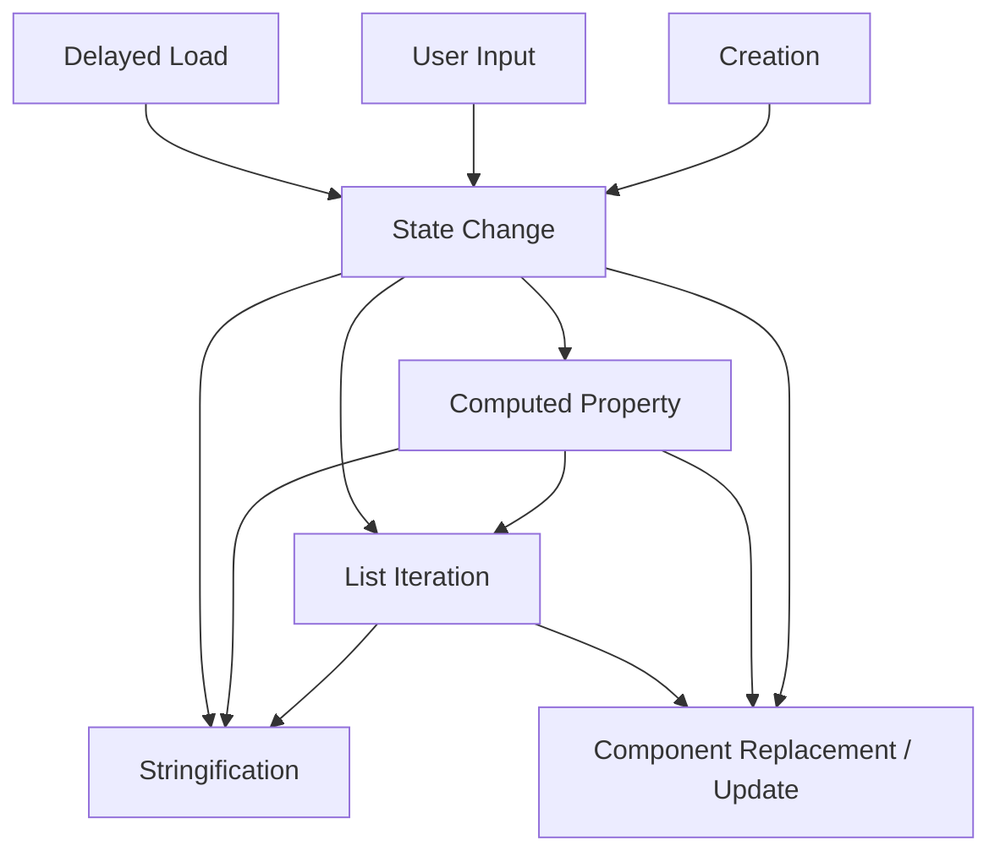
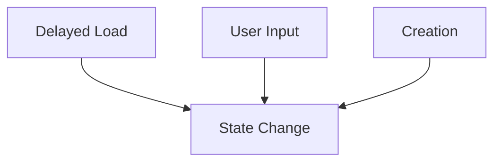
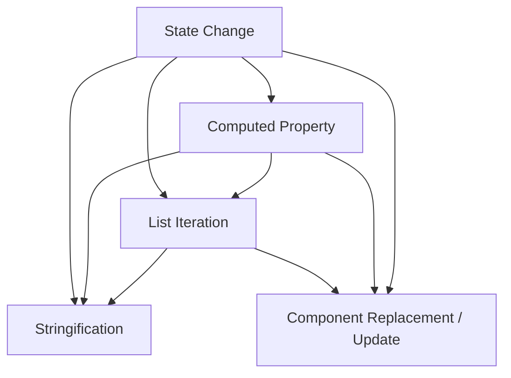

```mermaid
graph TD
  c[Creation]
  dl[Delayed Load]
  ui[User Input]
  sc[State Change]
  s[Stringification]
  li[List Iteration]
  cu[Component Replacement / Update]
  cp[Computed Property]

  dl --> sc
  ui --> sc
  c --> sc
  
  sc --> s
  sc --> cp
  cp --> s
  sc --> li
  li --> s
  li --> cu
  cp --> cu
  sc --> cu
  cp --> li
```

---

- [State Change Triggers](#state-change-triggers)
- [State Change Events](#state-change-events)

# State Change Triggers

```mermaid
graph TD
  c[Creation]
  dl[Delayed Load]
  ui[User Input]
  sc[State Change]

  dl --> sc
  ui --> sc
  c --> sc
```

# State Change Events

```mermaid
graph TD
  sc[State Change]
  s[Stringification]
  li[List Iteration]
  cu[Component Replacement / Update]
  cp[Computed Property]

  sc --> s
  sc --> cp
  cp --> s
  sc --> li
  li --> s
  li --> cu
  cp --> cu
  sc --> cu
  cp --> li

```