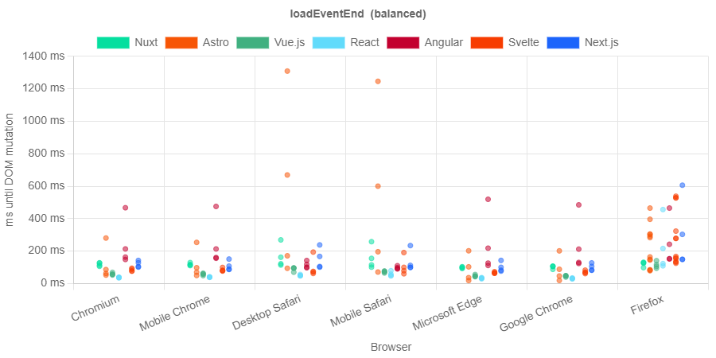

# Page load times

## Outline

1. Which pages load fast?
2. How much does much post-rendering-data add to load time?
3. Which frameworks creates fast-loading pages?
4. Does it match my expectations?

Legend info:
- Astro (mixed) means React components are used everywhere
- Astro on Vercel is the duplicate variant
- Nuxt is tested both with is `nuxt build` and `nuxt generate` build scripts

**Metrics**:
- TBW
  - Nuxt(build, local) produces bigger index, create and profile page for the initial pages
  - Create page is the only really surprising one
  - About page has no large multimedia files and is therefore very small
- TTFB
  - Local environments are equal across pages and frameworks
  - CSR apps (Vue, React and Angular) are slower than the rest on the index page
  - Astro is much slower for the profile page
  - The other pages are not interesting (~200 ms slower for Vercel)
- TTI
  - React on Vercel slower on data-loading pages (feed and profile)
  - Astro is in general very good
  - Nuxt and Svelte are generally better on Vercel
  - Astro duplicate is faster on data-loading pages (because Astro components are interactive faster)
- DomContentLoaded
  - local is better across the board
  - Astro is the worst on Vercel, especially on data-loading pages (feed and profile)
  - React and Vue are very fast across the board
  - Astro mixed is faster on data-loading pages (because React components apparently don't count towards domcontentloaded)
  - Nuxt generate is faster on all pages except the feed page locally
- TBT
  - non-existent on About except Angular because all files are loaded on the initial request and nothing is loaded on navigation
    - quota of unused component code is low only on the profile page
  - Next.js is blocking relatively high on many pages except create, slower than React
  - Astro duplicate is 0 across the board
  - Vue and Svelte also very low
- OLVC
  - local is better (because of network changes)
  - Nuxt is the wors on almost every path and hosting environment except Angular on Vercel
- LCP
  - Astro mixed clearly not good on data-loading pages
  - Astro duplicate is good across the board
  - local test seem to be worse
  - bad performance with Angular cannot be explained
- LoadEventEnd
  - Astro
    -  Page Load (Index, domComplete 2360 -> 2472 -> 2594 ms, responseEnd schon über 2000 ms) unter Firefox
    -  Page Load (About, domComplete 2169 -> 2196 -> 2209 ms, responseEnd schon über 1500 ms) unter Firefox
    -  Page Load (Create, domComplete 2224 -> 2264 -> 2232 ms, responseEnd schon über 2000 ms) unter Firefox
    -  Page Load (Profile, domComplete 2514 -> 2392 -> 2355 ms, responseEnd schon über 2000 ms) unter Firefox
 - Svelte
    - Page Load (Index, domComplete 2616 -> 2588 -> 2586 ms, responseEnd schon über 2000 ms) unter Firefox
    - Page Load (About, domComplete 2202 -> 2219 -> 2212 ms, responseEnd schon über 1500 ms) unter Firefox
    - Page Load (Create, domComplete 2273 -> 2199 -> 2229 ms, responseEnd schon über 2000 ms) unter Firefox
    - Page Load (Profile, domComplete 2372 -> 2349 -> 2341 ms, responseEnd schon über 2000 ms) unter Firefox

## Content

For page laod times, the TBW, TTFB, observed domContentLoaded, TBT, observed LVC and LCP as well are presented quantitatively from the Lighthouse reports and the loadEventEnd is deduced qualitatively from test passes from the Playwright tests concerning page load times. The results of Lighthouse tests are visualized per path. On each path, each framework's application is tested once on Vercel and once hosted locally with two exceptions. First, Nuxt is tested with its `nuxt build` and `nuxt generate` build scripts. Second, Astro is tested locally with both duplicate components (Astro and React) and its mixed version, in which the React components do not have Astro duplicates even if the component not dynamic. The version hosted on Vercel is the version with duplicate components.

The TBW is presented in figure `X`. Primarily, the great size of the pages built with Nuxt-build stands out. Out of all four pages, this is mainly surprising for the create page because on initial load only one multimedia file has to be loaded. Yet, the create page and the profile page appear to be equal in byte size although on has more images to it. Moreover, the byte size decreases for Nuxt-generate for the profile page, a property of the build structure that cannot be see on the Feed page. This characteristic of Nuxt can be explained through the implementation of the MediaComponent (see listing `X`). All images files are imported using `import.meta.glob()` (see line `X`). For this reason, the byte size of the page is at least the size of all images on pages that use MediaComponent. Although this import method is used with Astro, Svelte and Nuxt, Nuxt is the only framework with which this behaviour seems to have this impact.
Secondly, the About page has a small byte size, which is not suprising because it has only one SVG as image.

In general, Next, Astro and Svelte have a small byte weight on the Feed page as well as the Profile page , most likely due to successfully image compression. The byte weight of the create page and the Profile page is a representation of how well the framework handles selecting which parts of their application have to be loaded. For the Create page, eight out of the 15 components of the app have to be loaded (9 out of 16 for Astro duplicate) and five of 15 for the Profile page. Interestingly, the Create page weighs less than the Profile for most frameworks except Nuxt.

The measurements for the TTFB indicate clearly the response time difference from locally hosted applications to applications hosted on Vercel (see figure `x`). To this end, the timings of the About page can be examined. The difference in TTFB around 185 ms with local applications sitting between 452 and 457 ms and Vercel responding within 632 - 651 ms. Taking this difference as the normal difference, additional measurments stand out. Although the local webserver return the first byte almost equally fast on all paths, Nuxt-generate takes 80 ms longer than its sibling Next-build on the Feed page and the first reponse byte is registered 19 ms on the Feed page with Svelte than the other paths.

On Vercel, the TTFB fluctuates more between the frameworks. On the Feed pagem the frameworks can be separated into three groups. Astro, Nuxt-generate and Svelte are the fastest with respose times between 635 and 657 ms. Between 712 and 756 ms lie the times for Next.js, React, Nuxt-build and Vue.js. Angular has the slowest response time on Vercel and on the Feed page with 882 ms. The response times from Vercel on the Create page are increased for Astro to 1073 ms by about 430 ms compared to its competitors. A similar increase is measured on the Profile page with a TTFB for Astro on Vercel of 872 ms (about 230 ms later than other frameworks).

The TTFB of Nuxt-build on Vercel on the Create is increased by only 15-20 ms and the response time of Next.js on Vercel on the Profile page is 35-43 ms later than other frameworks.
These average measurements could easily be ascribed to any of the afformentioned variability in Lighthouse tests (see `source` or section `X`), but might also indicate an actual performance decrease.

The TTI of the applications is shown in figure `X`. In contrast to the TTFB, the TTI is faster on Vercel with the exception of React on the Feed page and both React and Astro on the Profile page. Possible reasons for this phenomenon include the content encoding, which is missing from local hosting environments, or simply better webserver performance such as parallelization of request handling on Vercel. With these faster applications on Vercel, Astro, Svelte, Next.js and Vue.js turn out to be the fastest frameworks for the TTI of the application with the exception of React and Next.js having the longest TTI on the Feed page and React also having a longer TTI on the Profile page than its competitors. In general, Astro appears to be the framework from which the application has the fastest TTI across pages and hosting environments. <!-- ?REVIEW: why? -->

Interestingly, Vue.js, Nuxt, Svelte, Angular and Astro show small fluctuations inbetween pages of 500 ms or less which is relatively little compared to Next.js and React. <!-- ?REVIEW: why? -->

Figure `x` shows the average of observed times of the domContnentLoaded event. Two general characteristics stand out of the data. First, the timings of the applications that are hosted locally are at least 45 ms earlier than the applications hosted on Vercel and, second, the observedDomContentLoaded is measured to be much earlier than the TTFB. The first can be explained by the slower network speed. The unlogical order of TTFB and observed timing of the  domContentLoaded event goes back to throttling not being applied for "observed" metrics ([source](https://github.com/GoogleChrome/lighthouse/discussions/14190#discussioncomment-3093932)).

Astro on Vercel shows the latest domContentLoaded times  on Vercel except on the About page. On the other hand, Astro locally shows some of the fastest times on the About page and the Create page. Angular, Nuxt-build, Next.js and Svelte are the other frameworks with late times for the event. In contrast, React, Vue and Nuxt-generate build applications with earlier event time. Both measurement characteristics can be explained by the rendering behaviour of the applications. Astro returns the fully complete DOM in its inital HTML document, whereas the frameworks of the second fastest group return half-complete HTML documents. These frameworks demonstrate their rendering-capabilities here. The fastest frameworks for this metric respond to the request with HTML skeletons, which naturally results in fast domContentLoaded events.
Interestingly, Angular and Nuxt-generate break this pattern. Angular also generates an HTML skeleton for all pages, which references CSS and JS files. The main difference to Vue.js, for example, is that the JS modules are included in the HTML `<body>` for Angular and in the HTML `<head>` for Vue.js. Additionally, all referenced scripts are lazy-loaded with Vue.js and the scripts for the Angular application are packed into fewer and bigger JS files. Nuxt-generate on the other hand does not return an empty HTML skeleton and is still in the group of fastest frameworks for this metric. The main difference to other frameworks is that JS files are included in the HTML with `rel="modulepreload"`. Both of these strageties appear to have a noticable impact on the timing of the domContentLoaded event.

The results of measurements for the TBT show drastic differences between the frameworks (see figure `x`). On the one hand, the blocking time is practically negligible for most frameworks on the About, Create and Profile page indicating no unnecessary code execution before rendering. On the other hand, some frameworks show relatively large TBT, escpecially on the Feed page. Firstly, Astro and Svelte are among the fastest frameworks in the TBT, although Astro with duplicate components demonstrates a blocking time of 31 ms on the Feed page.
Secondly, the applications built with React and Vue also have a short blocking time and thirdly Angular produces an application with very low blocking time when hosted locally using the `serve` command, but high blocking time when hosted on Vercel. Both can be explained through an analysis of the scripts and modules loaded and executed on page load. While Vue and React include their scripts in smaller files and only reference script when needed, Angular executes JS in fewer and bigger files. This increases the blocking time for code, escpecially for code that is not needed for the page. The low TBT for Angular hosted locally cannot be explained with this interpretation.

The main outlier, however, is Next.js on the Feed and the Profile page. The TBT of the application surpasses its next competitor's TBT by 254 ms on the Feed page on Vercel, 164 ms on the Feed page locally and 56 ms on the Profile Page on Vercel. This is not definitively explainable, but the fact that this effect only greatly affects pages in which images are included using the MediaComponent is an indicator. Images and videos are loaded using ``require(`@/assets/stock-footage/${src}`).default``, which is similar to React's ``require(`src/assets/stock-footage/${src}`)`` (see listing `X`, line `x` and listing `Y`, line `y`). The iterpreted behaviour then is that both applications load the multimedia file synchronously, but Next.js also loads the components synchronously, which results in such a high TBT. This would also explain why the effect is less on the local webserver.

Unsurprisingly, the measurements for the OLVC are also in general faster when the application is hosted locally (see figure `x`). Next.js is the only exception to that on the Create page. Amongst the frameworks, no clear separation can be identified across the pages or hosting environments, although Vue.js and React are always among the fastest in this metric compared to other frameworks with the same hosting method. Additionally, Nuxt has the slowest OLVC across pages, especially on the Feed page. However, the average of Nuxt-build on Vercel is deceiving.

Figure `y` shows the distribution of the OLVC measurements throughout the 20 test repetitions. It is clear that most measurements lie around 4500 ms rather than the  average of all values which is 6012 ms. Nonetheless, the OLVC of Nuxt is still far above the average of other frameworks.

The average measurements for LCP are shown in figure `X`. In contrast to other presented metrics, the time of the LCP is in general earlier for applications hosted on Vercel. However, both Astro implementations regularly have a faster LCP locally than other frameworks on Vercel. Other than that, no clear outlier framework can be identified except Angular. The LCP measurements are extraordinarily high on the Feed page when hosted locally and on the Profile Page independently from the hosting environment. There is no apparent explaination for either characteristic at this time.

`Test results table for page load times`

The numbers of passed page load tests with Playwright are listed in table `x`. The only frameworks with which the application does not load are Astro and Svelte. For both frameworks teh page load budget is exceeded on all four pages of the application when opened in Firefox. The repetitions of failed tests also exceed the time budget, which causes the tests to be marked as failed. Figures `x` and `y` show the timings of loadEventEnd across browsers, frameworks and pages, including test repetitions. It is clear that these measurements are outliers compared to other frameworks. The load speed in Firefox is slower than the budget only for Astro and Svelte. Upon inspection of other navigation event times, the reason for this result becomes clear. The time of requestStart for the failing frameworks in Firefox is already above 2000 ms for all pages. Interestingly, the timing of this navigation event is not late for all other frameworks. This differentiating behaviour could not be explained in the time frame of this study. However, the next step in the analytic process was to inspect a balanced metric insted of inspecting the raw measurement of the loadEventEnd. The balanced loadEventEnd time can be described as $loadEventEnd_{balanced} = loadEventEnd_{raw} - requestStart$.

Figure `x` shows the new balanced values. Using the balanced metric, all pages from all frameworks are loaded within the page load time budgets. Still, differences can be found between frameworks and between browsers. The overview over all results show 4 different patterns within a browser. Unsurprisingly, Chromium and Mobile Chrome as well as Webkit and Mobile Safari have similar results. They differ mainly in the load times of Astro, Svelte and Angular pages. The third pattern can be found in Microsoft Edge and Google. Pages load relatively fast in these two browsers, especially with Astro. The measurements made in Firefox do not resemble the ones made in other browsers. First, the results are slower on average and it is the only browser in which the load times of React pages fluctuate more than 30 ms. Second, the fastest times with React are slower than the fastest times with Astro, Nuxt and Vue.js.

As for the frameworks, React is clearly the fastest here in Chromium, Mobile Chrome, Webkit and Mobile Safari and second fastest in Microsoft Edge and Google Chrome. Vue.js is second fastest in most browsers and also fluctuates very little. Nuxt, Next.js and Svelte are the next-fastest across browsers. Angular is one of the slowest frameworks for most pages and browsers with a few exceptions using Astro. The fastest or the slowest measured times are measured with Astro depending on the browser, but always fluctuate relatively much compared to other frameworks.
