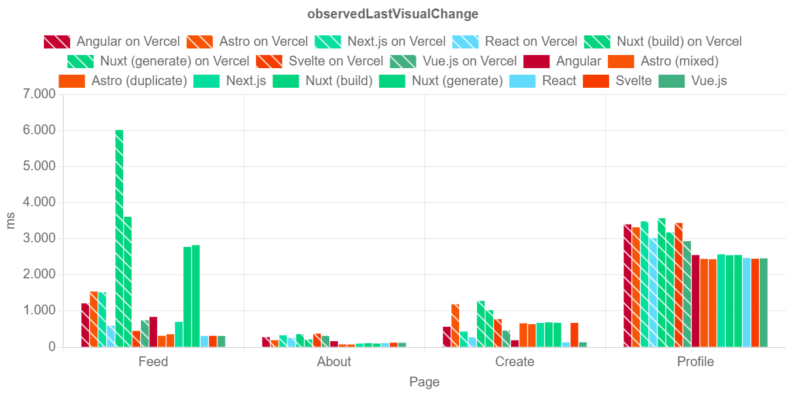
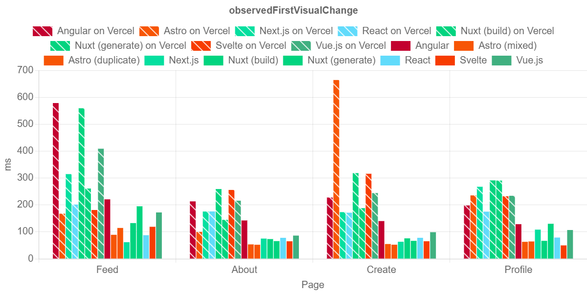
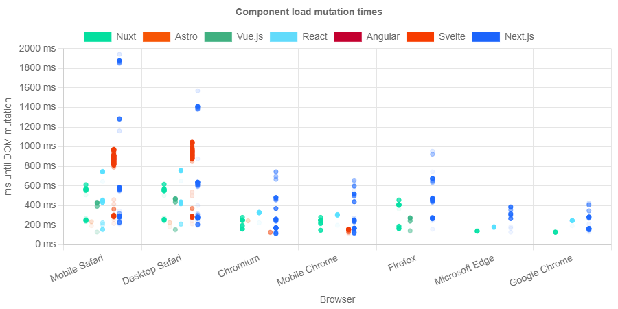

# Component load times

## Outline

1. Which components load with delay?
2. Which frameworks have fast-loading delayed components?
3. Do pre-rendered pages even have delayed components?

- OLVC, TBT, TTI, LoadEventEnd
  - no new interpretations
  - every measurement above the page load time budget might be a results of slow-loading components
- OFVC
  - local is better across pages and frameworks
  - Astro, React and Next are good except Astro on Vercel on the Create page
  - Angular very bad compared to other frameworks
  - On Vercel, Nuxt-generate is better
  - Interesting: Difference between OFVC and OLVC
    - difference between local and Vercel mean last change is dependent on network speed rather than JS execution
    - Vue, React and Angular stand out because the difference is small, even when the ofvc is high
    - chained JS service show on the Profile page
- MutationTimes
  - no recordings means either to fast or too slow (less likely at 10 seconds)
    - Angular has no recorded measurements at all
    - Astro has only 11
    - Vue.js has only 174
    - React has 527
    - Nuxt (1011), Svelte (1857), Next (1654) have above 1000 recorded mutations
  - Webkit and Mobile Safari have a lot of late recordings
  - ME and Google Chrome have very few recordings and no late ones

## Content

The load time of components indicates the difference between how well frameworks split the load time of their applications between parts of the pages. The relevant metrics for the component load are OLVC, TBT, TTI, time of the loadEventEnd, OFVC and the measured DOM mutation times immediately after initial page load. To measure these metrics, the Lighthouse tests are executed as described previously and Playwright tests are documented as decribed in section 08.15. The same rules for the presentations of the results apply in this section.

---

Because the same time frame is inspected as in the previous section, the relevant metrics OLVC, TBT, TTI and balanced loadEventEnd can be used to analyze the load behaviour of components (see figure `x` `y` `z`). However, no new interpretations can be taken from concerning component load times because every measurement that includes the complete page load might be the results of slowly loading components. Therefore, failed tests due to the time budget being exceeded cannot only be unequivocally attributed to either slow network speeds, browser or client behaviour or the used framework. Additional metrics are needed to identify component load times.

---

The OFVC demonstrates the time after which the first visual change is made within the viewport (see figure `x`). It can be either the time after which prerendered HTML elements appear or the time after which an empty DOM gets filled through JS and visual changes are made. The measurements for the OFVC show that, in general, the first visual change is earlier for locally hosted pages, which is unsurprising. Frameworks with an early OFVC are Astro, React and Next.js with the Create page with Astro on Vercel being the only exception. The Angular application on the other hand displays late OFVC values compared to its competitors locally. On Vercel, Nuxt-build has late values across all pages.

More interesting than the raw OLVC and OFVC values is the difference between the measurements. The newly defined metric "observedVisualChangeDuration" shows the time after the first visual mutation to the page has been made until the last visual change. It is simply deferred from the OLVC and OFVC and is defined as 

$$
\mathit{observedVisualChangeDuration} = \mathit{observedLastVisualChange} - \mathit{observedFirstVisualChange}
$$

Figure `x` shows the values of this metric. A great value between locally tested applications and applications on Vercel means that visual changes, especially the last, are dependent on network delay or JS execution speed. Vue.js, React and Angular produce low OVCD on most pages except the Profile page. This is even the case if the OFVC is late. This is because no visual changes are made to the page until the HTML and JS is parsed and executed. This stands in contrast to prerendered, server-side rendered or semi-rendered pages. With these pages, the first visual update can be made only after the HTML is parsed. Therefore, CSR frameoworks can achieve faster OVCD on the pages with components that have differntly fast loading components.

Notably, the Profile page is an outlier among the pages. This is because the static header of the page can be displayed as soon as possible, but the rest of the page needs two service functions to finish before images and videos can be loaded. The effect of these chained JavaScript executions can clearly be identified using the OVCD.

---

Figure `x` shows the DOM mutation times of elements after the initial page load that were registered with Playwright right after initial page load. Primarily, the most noticable results of these measurements is that some results appear to be missing. For example, there are no measurements from the Angular application at all. The reason for missing measurments could be that call DOM mutations have taken place before the MutationObserver could be initialized because the injection of the recording script through Playwright takes longer than the page load or all changes take place inbetween the interval of 100 ms (see listing `x`, line `y`). The other possible reason for this phenomenon could be that mutations are slower than the manually defined recording time of 10 seconds (see listing `x`, line `y`), but it is less likely since no mutation is recorded to be over 1900 ms with any browser, page or framework. Therefore, missing recordings indicate the framework is either loading too fast or too slow to record DOM mutations. Because the applications have differences in the DOM structure, the number of mutations fluctuates naturally. Adjusting for possible variations here, four frameworks have missing measurements. Applications from Angular (0 mutations),  Astro (11 mutations), Vue.js (174 mutations) and React (527 mutation) have surprisingly few mutations. The applications built with Nuxt (1011 mutations), Next.js (1654) and Svelte (1857 mutations) have more than 1000 mutations. Although these number could indicate full recording coverage of the mutations, the distribution of recordings between browsers and pages prove that not all mutations were recorded, even with these three frameworks. No mutations were recorded on the About page with Nuxt and Next.js. In fact, Svelte is the only framework with which mutations were recorded on the About page, but only in Mobile Chrome, Chromium, Mobile Safari and Webkit. Then again, there are apparently no mutations on the Profile page with Svelte in any browser. Figure `x` grafically demonstrates all recorded mutations.

Although the missing data prevents some unambiguous comparisons between frameworks, the presences of some recordings indicates load speed differences between frameworks and browsers. First, many recordings could be made in Webkit and Mobile Safari. This indicates that the method of measurement of DOM mutations results in slow mutation times in these browsers, especially with Svelte and Next.js. The possibility of missing DOM mutations because of the limited recording time is non-zero, but can be ignored here because other measurements match the interpretation (see section `5.3`). Additionally, in Microsoft Edge and Google Chrome only very few measurements could be made, so the two browsers can be considered especially fast for this measurement method.
Second, Next.js appears to be the slowest of the frameworks in this metric. Svelte also demonstrates slow mutations, but only in Webkit and Mobile Safari. The other frameworks that appear in the summary of mutations, Nuxt, React and Vue.js, also have some relatively high recorded mutation times, but all recorded times are below 760 ms. With these frameworks, the most interesting observation is that not only are the muataion times faster with Microsoft Edge and Google Chrome, but they are also more bundled toghether than with other browsers.

The last possible observation from the data is that no mutation time is below 100 ms. The implementation of the MutationObserver is the reason for this. Because the start time is defined immediately and the interval callback is executed first after 100 ms, no mutation times below 100 ms can be recorded.