# Mega-fast or just super-fast? Performance differences of mainstream JavaScript frameworks for web applications
<!-- 
_paginate: false
_header: ""
_footer: ""
_class: lead
-->

<!-- 
- Dankeschön
  - präsentieren zu dürfen
  - Zeit, in Präsenz
- Titel
  - Performance-Unterschiede in Endprodukten
-->

Andreas Nicklaus
17.10.2024

# Agenda

<!-- 
1. Thema einführen + Tiefe
2. Fragestellung für heute
3. Strategien zur Beantwortung + erklärende Worte zu Design
4. wichtige Ergebnisse: graphisch + Zahlen für Interpretation
5. 5 Minuten Lessons Learned für weitere Arbeiten

<PAUSE>
-->

1. Themenübersicht
2. Fragestellung
3. Lösungsstrategie und -design
4. Ergebnisse
5. Lessons Learned

# 1. Themenübersicht

<!-- 
- gefundene Definition
- moderne Webseiten
  - other factors -> JS
  - statisch und dynamisch
    - Komplexität
    - Vorhersehbarkeit der Performance
- Diagram
  - dynamische: +Nutzer, +Netzwerk, +Services (Backend, DB, APIs)
  - viele Faktoren
  - Probleme -> langsamster Pfad
-->

> Websites are made up of files written in HTML and CSS that are rendered and displayed in web browsers. They can be static, with pre-defined content, or dynamic, changing automatically based on user input or other factors. [[1](https://www.scribd.com/document/471812575/A-website)]

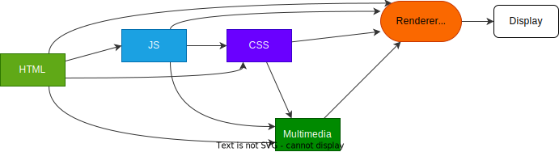

---

<!-- 
- Für Entwickler schwieriger
- Pfad rechts aufwendig
- Pfad links fast unmöglich
- Hoffnung: Foren für gewähltes Framework
- -> Frage nach bestem Framework 
-->

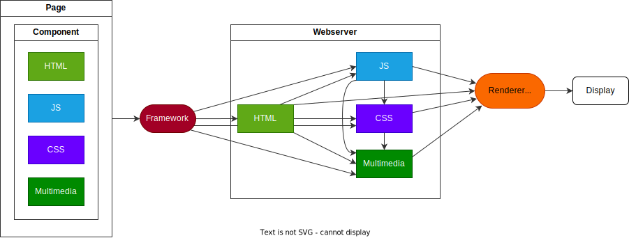

# 2. Fragestellung

<!-- 
Oder anders formuliert: <VORLESEN>

- 3 Aspekte herausstellen
-->

> Hat die Wahl des Frameworks einen für den Nutzer merklichen Einfluss auf die Render-Geschwindigkeit der Webseite?

# 2. Fragestellung

<!-- 
1. Framework
   1. Entwicklungs-Framework
   2. nicht einfach & gut konfigurierbar, sondern as is
-->

> Hat die Wahl des Frameworks einen für den Nutzer merklichen Einfluss auf die Render-Geschwindigkeit der Webseite?

- Framework

# 2. Fragestellung

<!--
2. für den Nutzer merklichen Einfluss
   1. unterschiedlich
   2. technisch vs wahrgenommen
   3. Zeiten unter 30ms ignorieren
-->

> Hat die Wahl des Frameworks einen für den Nutzer merklichen Einfluss auf die Render-Geschwindigkeit der Webseite?

- Framework
- für den Nutzer merklich

# 2. Fragestellung

<!-- 
3. Render-Geschwindigkeit
   1. viel Facetten -> Tendenzen
   2. Beispiel: schnelle erste Änderung, späte letzte Änderung

<PAUSE>
-->

>Hat die Wahl des Frameworks einen für den Nutzer merklichen Einfluss auf die Render-Geschwindigkeit der Webseite?

- Framework
- für den Nutzer merklich
- Render-Geschwindigkeit

# 3. Lösungsstrategie und -design

<!--
- Versuch der Antwort -> 6 Dimensionen eingegrenzt
1. Frameworks
2. Anwendung: Bündelung, wiederverwendbare Ressourcen
3. Network Delay -> Hosting-Umgebung
4. Metriken beschreiben Untersuchungs-Gegenstand
5. Werkzeuge: Overhead -> -Performance
6. Browser
-->

1. Frameworks
2. Anwendung: Seiten, Komponenten und Content
3. Hosting-Umgebung
4. Metriken & Untersuchungsgegenstand
5. Test-Tools
6. Browser

## 3.1 Frameworks

<!-- 
FRAMEWORKS:
- CSR und SSR vorlesen
  - Big 3
  - Liebling Astro
- Wahl:
  - vergangene Nutzung
  - Bereitschaft zu Nutzung
  - Neigung unter Entwicklern mit Erfahrung im Framework
- Bewusst CSR UND SSR
-->

| CSR     | SSR     |
| ------- | ------- |
| Angular | Astro   |
| React   | Next.js |
| Vue.js  | Nuxt    |
| Svelte  |         |

**Entscheidungskriterien:** [[2]](https://2023.stateofjs.com/en-US/libraries/front-end-frameworks/)
- Nutzungsquote
- Empfehlungsrate

## 3.2 Beispielanwendung

<!-- 
- Vergleich bedarf gleicher Umstände
  - sonst max. 2 Frameworks
- Nachbildung der App Instagram
- 4 Seiten
- Delayed vs statisch
- Create: Spezialfall -> Dynamisch
- Komponenten: Wrapper und Funktionen
  - Möglichkeit für un-konfigurierte Performanceoptimierung
-->

  
  
  
  

## 3.3 Hosting-Umgebung

<!-- 
HOSTING:
1. Anbieter
   1. Realistische Netzwerkverzögerung + Serverauslastung
   2. SSR-Funktionen
   3. kostenlos -> kleine Projekte
   4. Github + Github Actions
   5. Verbreitet
   6. Mit Netzwerkanfragen untersucht
2. Localhost
   1. ohne Netzwerkverzögerung
   2. Preview oder serve
   3. Baseline für Browser-Prozesse
-->

### Vercel
- Network Delay
- Kostenloses Konto
- CI/CD Integration

### Localhost
- Reine Render-Geschwindigkeit
- `serve` oder Framework Preview
- Baseline ohne Netzwerkverzögerung

## 3.4 Metriken

<!-- 
METRIKEN:
- 3 Kategorien
- PLT
  - klassische PLT
  - requeststart bis DomContentLoaded
- CLT
  - Prozesse im Browser ohne...
    - Netzwerk
    - Serveraktivitäten (SSR)
  - Baseline für Browserprozesse
- Component Update Time
  - Reaktion auf Eingaben
    - Nutzereingaben
    - Websocket Nachrichten
  - nach PLT und CLT
-->

3 Kategorien zur besseren Unterteilung:

- Page Load Time (PLT)
- Component Load Time (CLT)
- Component Update Time (CUT)

---
<!-- _class: center-->
<!-- 
- Kategorien zuweisen (nur PLT)

1. TBW: Netzwerk-Bytes
2. TTFB: requestStart bis erstes Antwortbyte
3. DomContentLoaded: requestStart bis DOM geladen
4. LVC: letzte sichtbare Änderung im Viewport
5. LCP: Renderzeit des größten Element im Viewport -> empfundene Ladezeit 
-->

|                          |  PLT  | CLT | CUT |
| ------------------------ | :---: | --- | --- |
| Total Byte Weight        |   x   |     |     |
| Time To First Byte       |   x   |     |     |
| DomContentLoaded         |   x   |     |     |
| Last Visual Change       |   x   |     |     |
| Largest Contentful Paint |   x   |     |     |

---
<!-- _class: center-->
<!-- 
1. TTI: requestStart bis DOM "interactive"
2. TBT: von Nutzereingaben abgehalten (Code / Parsing)
3. LoadEventEnd: requestStart bis OnLoad des DOM

4. OFVC und OLVC: requestStart bis visuelle Änderung im Viewport
5. DOM Mutations
   1. nicht bekannt
   2. im HTML Root-Element pro Framework
   3. Laden und User Input
-->
|                              |  PLT  |  CLT  |  CUT  |
| ---------------------------- | :---: | :---: | :---: |
| Time To Interactive          |   x   |   x   |       |
| Total Blocking Time          |   x   |   x   |       |
| LoadEventEnd                 |   x   |   x   |       |
| Observed First Visual Change |       |   x   |       |
| Observed Last Visual Change  |       |   x   |       |
| DOM Mutation Times           |       |   x   |   x   |

## 3.5 Test-Tools

<!-- 
1. erste Station Lighthouse
   1. Sammlung an Metriken
   2. CLI: Automatisierung
   3. techn. mögl.: andere Browser
   4. Google Produkt -> Headless Google Chrome
2. Playwright
   1. prim. Content & Interaktionen
   2. Custom Skripte im Browserfenster
   3. Black Box mögl. -> Unabhängig von Entwicklung
   4. Browserwahl 
-->

### Lighthouse CLI
- State of the Art für Web-Performance
- Umfangreiche Sammlung an Metriken
- Automatisierung von Tests
- Google Chrome

### Playwright
- Tests für Content und Interaktionen
- Custom Tests
- Injektion von Skripts 
  ➡️ Black-Box-Testing
- Freie Browser-Wahl

---

<!-- _class: center-->
<!-- 
- Lighthouse:
  - Aggregat
- Playwright:
  - Window-Kontext
  - Custom
-->

| Lighthouse                          | Playwright       |
| ----------------------------------- | ---------------- |
| Total Byte Weight (TBW)             | DomContentLoaded |
| Time To First Byte (TTFB)           | loadEventEnd     |
| Time To Interactive (TTI)           | Mutation Times   |
| Total Blocking Time (TBT)           |                  |
| Largest Contentful Paint (LCP)      |                  |
| Observed First Visual Change (OFVC) |                  |
| Observed Last Visual Change (OLVC)  |                  |

## 3.6 Browser

<!-- 
BROWSERS:
- Lighthouse nur Google Chrome
- Playwright Wahl nach Verbreitung

<VORLESEN>
<PAUSE>
-->

- Google Chrome
- Mobile Chrome
- Chromium
- Microsoft Edge
- Firefox
- Desktop Safari
- Mobile Safari

# 4. Ergebnisse

<!-- 
- Erkenntnisse vorwegnehmen -> richtige Augen

1. PLT und CLT unschlüssig für Frage
   1. Stärken und Schwächen
   2. undeutliche Bestlösung (CSR vs SSR)
2. CUT
   1. Tendenzen in Spannweite & Zeiten vom DOM Mutations
      1. Browser
      2. Frameworks
-->

- Unschlüssig für PLT und CLT
  - Ungleich verteilte Stärken und Schwächen der Frameworks
  - Undeutliche Tendenzen bzgl. Client-Side vs. Server-Side Rendering
- Undeutlich für CUT
  - Unterschiedliche Spannweiten und Zeiten der DOM Mutations
  - Durchschnittsranking von Frameworks und Browsern möglich

## 4.1 Page Load Time - TTFB
<!-- 
- lokal besser (nicht überraschend)
- Ausreißer:
  - Create & Profile: Astro
  - Feed: Angular, Next.js, Nuxt
-->

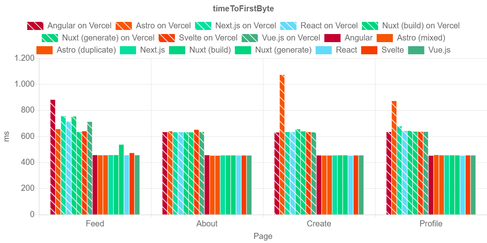

## 4.1 Page Load Time - TBW
<!-- 
- große Diff. unter Framework
- gut: Next.js, Astro, Svelte
- schlecht
  - Feed: Angular, Vue.js
  - generell, Nuxt
-->

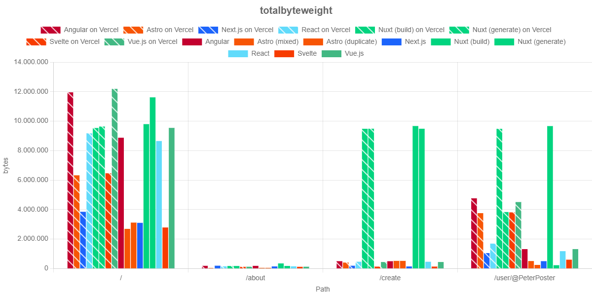

## 4.1 Page Load Time - TTI
<!-- 
- lokal schlechter (!!!)
- gut: Astro
- schlecht: Nuxt
- Abhängig v. Host & Seite: React und Svelte
-->

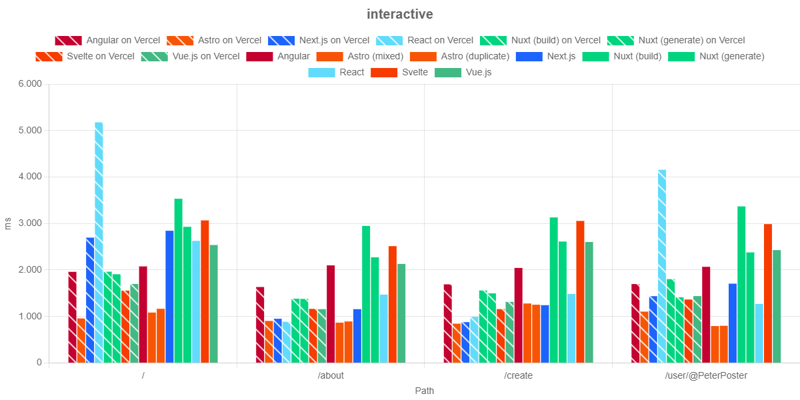

## 4.1 Page Load Time - DomContentLoaded
<!-- 
- lokal gut
- gut: React und Vue.js
- schlecht: Astro
  - statisch besser
-->

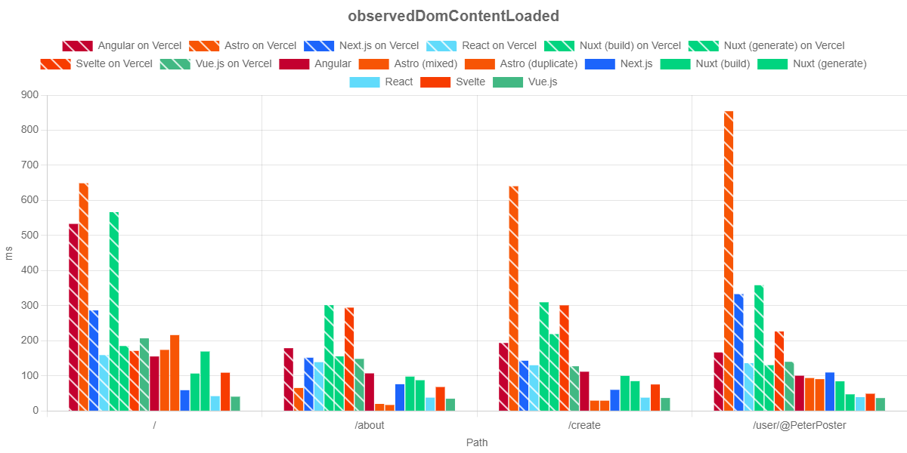

## 4.2 Component Load Time - LoadEventEnd
<!-- 
- Ausreißer: Astro & Svelte in Firefox
-->

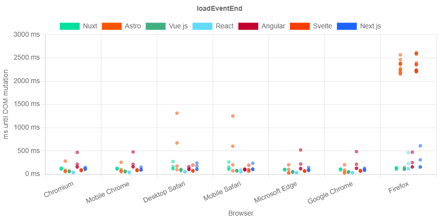

## 4.2 Component Load Time - balanced LoadEventEnd (1)
<!-- 
- unerfindlicher Grund: requestStart spät in Firefox
- Lösung: balanced loadEventEnd

<Formel>
-->
In Firefox werden Requests teilweise erst verspätet gemacht. Das balanced LoadEventEnd nur misst die Zeit nach dem Requeststart.

$$\mathit{loadEventEnd}_\mathit{balanced} = \mathit{loadEventEnd}_\mathit{raw} - \mathit{requestStart}$$

## 4.2 Component Load Time - LoadEventEnd
<!-- 
Alte Messwerte
-->

## 4.2 Component Load Time - balanced LoadEventEnd (2)
<!-- 
Angeglichenen Werte

- einziger Unterscheid: Firefox
- Rest:
  - schlecht:
    - Angular
      - Chromium, Mobile Chrome, Microsoft Edge, Google Chrome
    - Astro
      - Desktop Safari, Mobile Safari
-->

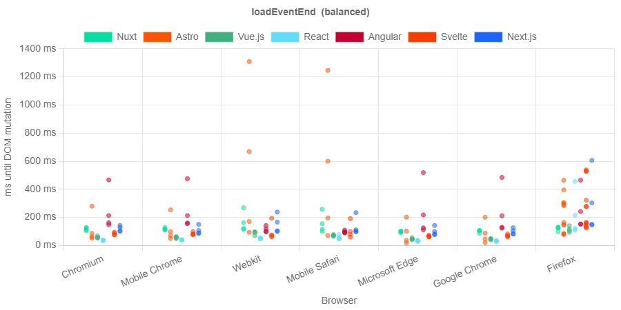

## 4.1 Page Load Time - OLVC
<!-- 
1. starke Ausreißer von Nuxt auf der Feed  
2. Profile: Chained Async Funktionen.
-->

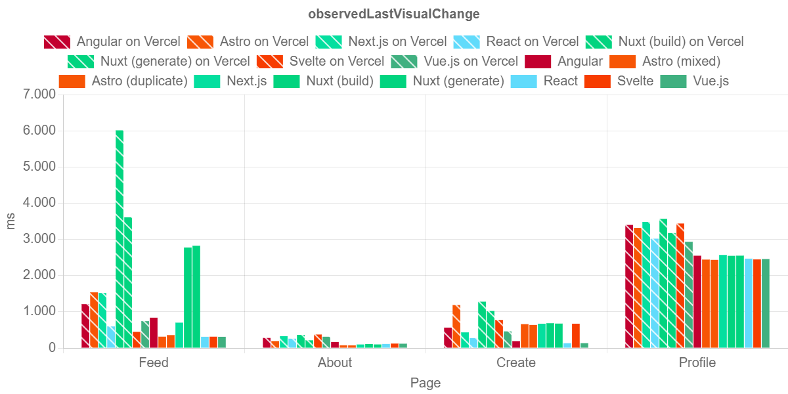

## 4.2 Component Load Time - OFVC
<!--
- Outlier, aber lokal deutlich besser
  - in OLVC nicht sichtbar
- interessant: Unterschied
-->

## 4.2 Component Load Time - OVCD
<!-- 
- OFCV und OLVC beinhalten Netzwerkzeiten
- dazwischen Render-Geschwindigkeit im Browser

Gleichung
-->
First und Last Visual Change umfassen auch die Datenübertragungs-zeit. Die Observed Visual Change Duration beschreibt die Zeit zwischen Anfang und Ende der visuellen Änderungen.

$$\mathit{observedVisualChangeDuration} = \mathit{OLVC} - \mathit{OFVC}$$

## 4.1 Page Load Time - OLVC
<!-- 
OLVC
-->

## 4.2 Component Load Time - OVCD
<!-- 
OVCD

- hat nicht viel gebracht
  - OFVC relativ kurz
- Idee kann verbessert werden
-->

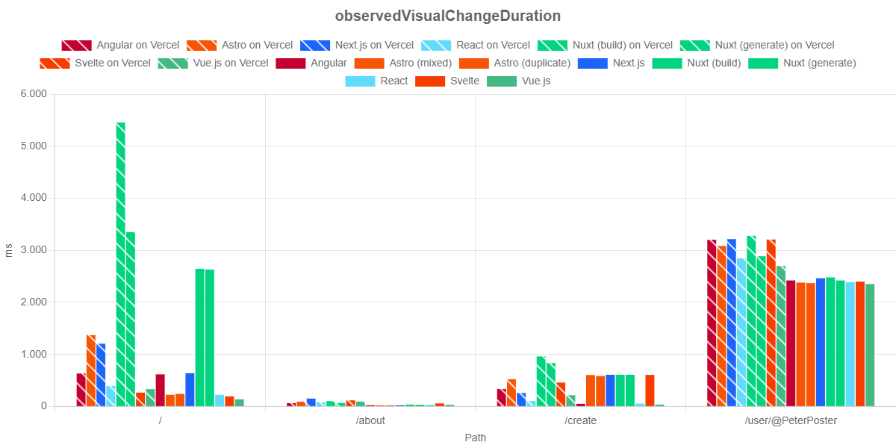

## DOM Mutation Times
<!-- _class: lead-->
<!-- 
- Laden & Updaten der Seite
- CLT und CUT
-->

- Component Load Times

- Component Update Times

---

<!-- 
1. Injection
2. Intervall
3. loadtimes
4. MutationObserver
5. DOM Mutation (id, xpath, Zeit -> Window-Kontext)
-->

### Aufzeichnung
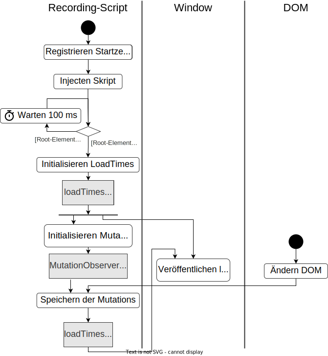

---
<!-- 
1. Seiten Laden
   1. 10 Sekunden warten
   2. Auswerten
2. User Interaction
   1. gleicher Prozess
   2. Reset
   3. Interaktion
   4. Warten
-->

### Nutzung
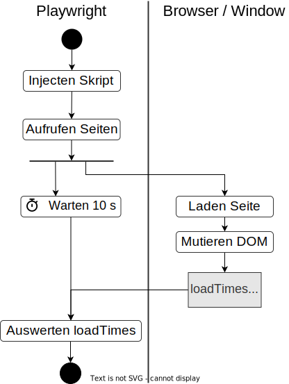

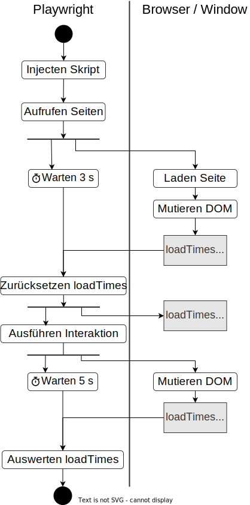

## 4.2 Component Load Times - DOM Mutations
<!-- 
Ergebnis:
1. schlechter: Next.js, Svelte
2. Unterschiede in Browsern
3. Aufzeichnungen fehlen
   1. Frameworks fehlen
   2. Grenze bei 100 ms
-->

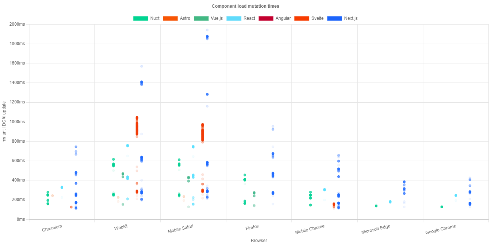

## 4.2 Component Load Times - DOM Mutations
<!-- 
- 2 Aufzeichnungsgrenzen (Init & Ende)
  - 100 ms Intervall für Erkennung Root Element
  - 10 Sekunden bis Ende
- Fehlend:
  - direkt nach Ladebeginn
  - länger als 10 Sekunden
-->
- Zwei Aufzeichnungsgrenzen
  - Initialisierungsintervall von 100 ms
  - festes Ende nach 10 s
- Fehlende Aufzeichnungen
  - Schnelle Updates beim Laden des DOMs
  - Langsame Updates nach Ende der Aufzeichnung

## 4.3 Component Update Times
<!-- 
- 4 User Actions: Formular -> Vorschau
- Caption
- Dropdown
- URL
- Caption + Dropdown
-->

1. Caption Insert
2. Media Selection
3. Source Insert
4. Post Creation (1. & 2.)

## 4.3 Component Update Times
<!-- 
1. gut: Nuxt (max. 200 unabhängig vom Browser)
2. langsam: Next.js (Firefox, Mobile Safari, Desktop Safari)
3. schnell:
   1. Chromium, Mobile Chrome, Google Chrome, ME
   2. Render-Engine Blink

<PAUSE>
-->

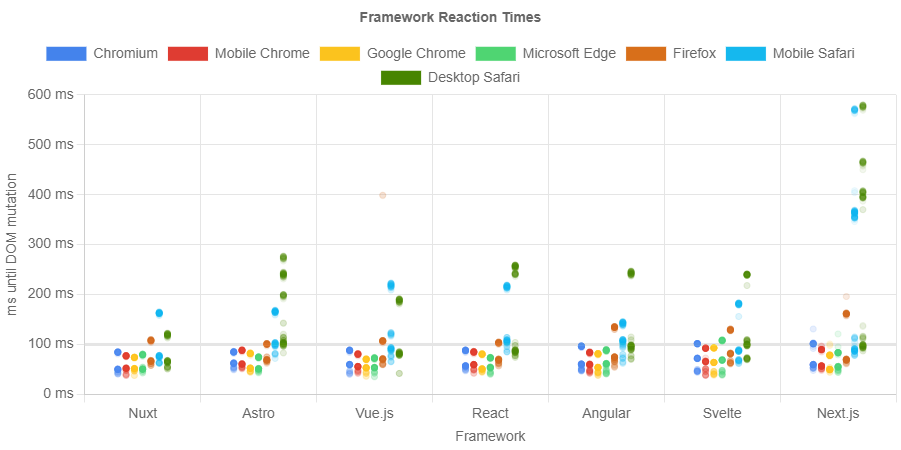

## 4.3 Component Update Times - Messungen
<!--
_class: table-sm
-->
<!-- 
- Min., Max., Durchschnitt
- rot: schlechteste Werte
- langsamste Browser
- gut: Nuxt (Ausnahmen)
- schlecht: Next.js (Ausnahmen)
-->

| ms             |    Nuxt | Angular |  Vue.js |   React |                   Astro |  Svelte |                      Next.js |       Ø |
| :------------- | ------: | ------: | ------: | ------: | ----------------------: | ------: | ---------------------------: | ------: |
|                |      51 |      77 |      47 |      84 | 
87
 |      70 |                           79 |      71 |
| Desktop Safari |  **86** | **123** | **136** | **169** |                 **170** | **164** | 
**304**
 | **164** |
|                |     124 |     172 |     200 |     280 |                     270 |     283 |     
493
 |     260 |
|                |         |         |         |         |                         |         |                              |         |
|                |      47 |      52 |      52 |      67 |                      78 |      56 |                           73 |      61 |
| Mobile Safari  | **110** | **106** | **133** | **126** |                 **154** | **126** |                      **196** | **136** |
|                |     167 |     152 |     206 |     183 |                     254 |     208 |                          372 |     220 |
|                |         |         |         |         |                         |         |                              |         |
|                |      59 |      54 |      52 |      54 |                      63 |      60 |                           59 |      57 |
| Firefox        |  **83** |  **89** |  **82** |  **84** |                  **99** |  **94** |                      **142** |  **96** |
|                |     108 |     123 |     103 |     181 |                     142 |     129 |                          235 |     146 |

## 4.3 Component Update Times - Messungen
<!-- 
- ähnlich
- mittlere Plätze umkämpft / Framework ungefähr gleich
-->
<!-- 
_class: table-sm
-->

| ms            |   Nuxt | Angular | Vue.js |  React |  Astro | Svelte | Next.js |      Ø |
| :------------ | -----: | ------: | -----: | -----: | -----: | -----: | ------: | -----: |
|               |     42 |      44 |     46 |     44 |     49 |     45 |      47 |     45 |
| Mobile Chrome | **61** |  **67** | **69** | **67** | **69** | **81** |  **94** | **73** |
|               |     82 |      90 |     89 |     82 |     85 |    116 |     143 |     98 |
|               |        |         |        |        |        |        |         |        |
|               |     39 |      44 |     51 |     44 |     51 |     38 |      47 |     45 |
| Chromium      | **66** |  **69** | **77** | **58** | **71** | **74** |  **75** | **70** |
|               |     94 |      95 |    104 |     85 |     89 |     95 |     108 |     96 |

## 4.3 Component Update Times - Messungen
<!-- 
- schnellste Browser: ME, Google Chrome
- grün: schnellste Werte
  - Astro war schon schlechtester Minimalwert
-->
<!-- 
_class: table-sm
-->

| ms             |                    Nuxt | Angular | Vue.js |  React |                       Astro | Svelte | Next.js |      Ø |
| :------------- | ----------------------: | ------: | -----: | -----: | --------------------------: | -----: | ------: | -----: |
|                |                      37 |      43 |     40 |     41 |                          44 |     40 |      46 |     42 |
| Microsoft Edge |                  **61** |  **70** | **61** | **62** |                      **64** | **74** |  **73** | **67** |
|                |                      85 |      90 |     79 |     75 |                          80 |    102 |     134 |     93 |
|                |                         |         |        |        |                             |        |         |        |
|                | 
34
 |      41 |     37 |     40 |                          43 |     39 |      41 |     39 |
| Google Chrome  |                  **60** |  **62** | **61** | **59** | 
**57**
 | **64** |  **69** | **62** |
|                |                      77 |      84 |     77 |     77 |     
72
 |     89 |      99 |     82 |

## 4.3 Component Update Times - Messungen
<!-- 
- Durchschnitt -> Ranking
- Rein:
  - 1: Nuxt
  - 2: Angular
  - 3: Vue.js, React
  - 5: Astro, Svelte
  - 7: Nex.js
- Weighted nach Nutzungsquote
  - 1: Nuxt
  - 2: Angular, Vue.js
  - 4: React, Astro
  - 6: Svelte
  - 7: Next.js
-->
<!-- 
_class: table-sm
-->

| ms                       |   Nuxt | Angular | Vue.js |  React |  Astro | Svelte | Next.js |
| :----------------------- | -----: | ------: | -----: | -----: | -----: | -----: | ------: |
|                          |     44 |      51 |     46 |     53 |     59 |     50 |      56 |
| Browser Average          | **75** |  **84** | **88** | **89** | **98** | **97** | **136** |
|                          |    105 |     115 |    123 |    138 |    142 |    146 |     226 |
|                          |        |         |        |        |        |        |         |
|                          |     35 |      45 |     36 |     45 |     48 |     42 |      45 |
| Weighted Browser Average | **60** |  **69** | **70** | **75** | **74** | **78** | **107** |
|                          |     80 |      94 |     93 |    110 |    104 |    118 |     167 |

## 4.3 Component Update Times - Ranking
<!-- 
Rankings:

<VORLESEN>
-->

### Frameworks
1. Nuxt
2. Angular
3. Vue.js
4. React
5. Astro / Svelte
7. Next.js

### Browsers
1. Google Chrome
2. Microsoft Edge
3. Chromium
4. Mobile Chrome
5. Firefox
6. Mobile Safari
7. Desktop Safari

# 5. Lessons Learned
<!-- 
- Zusammenfassung
- kritische Worte zu
  - Ergebnissen
  - Herangehensweise
  - Test-Ansätze zu DOM Mutations
-->
1. Ergebnisse
2. Methodik
3. Test-Ansatz für DOM-Mutationen

## 5.1 Ergebnisse
<!-- 
- Ergebnisse nicht ausreichen zu Antwort in PLT und CLT
- CUT: Tendenzen zu Performance-Unterschied
- Frameworks: Ø 69 - 107 ms 
- Browsers: Ø 62 - 164 ms
- größerer Unterschied erhofft und erwartet
-->
- Testergebnisse sind **nicht eindeutig** bzgl. Page Load Times und Component Load Times.
- Component Update Times zeigen **undeutliche Tendenzen** auf.

**CUT:**
- Frameworks: Ø 69 - 107 ms 
- Browsers: Ø 62 - 164 ms

## 5.2 Methodik
<!-- 
- Lücken in meiner Forschung
- Lighthouse schwankt um 30%
  - Verteilung interessanter
- Mehr Datenpunkte
  - Seiten & -arten
  - Komponenten & -funktionen
  - Hosting Möglichkeiten
  - Test Runs & zu Tageszeiten für Network Delay
-->
- Messergebnisse schwanken um bis zu 30%
- Verteilung der Ergebnisse könnte Performanceunterschiede aufzeigen
- Testumfang muss ausgeweitet werden
  - Seiten
  - Komponenten
  - Hosting Services
  - Test Runs

## 5.3 Test-Ansatz für DOM-Mutationen
<!-- 
- Verbesserungsmöglichkeiten

1. fehlende Aufzeichnungen
   1. Black-Box vergessen -> White-Box
   2. Events am Anfang und Ende von Änderungen
      1. Initialisierung signalisieren
      2. Ende von State-Change signalisieren
2. Navigation zwischen Seiten

<PAUSE>
-->
- Aufzeichnungen von DOM-Mutationen fehlen am Anfang und Ende der Tests
- White-Box Testing, um...
  - Aufzeichnungen zu triggern und...
  - Rendering-Ende zu signalisieren

- keine Tests zu Navigation zwischen Seiten

# Dankeschön!
<!-- 
_paginate: false
_header: ""
_footer: ""
_class: lead
-->
<!-- 
- Vorbereitete Antworten
- gerne unvorbereitete Antworten geben
-->
**Mega-fast or just super-fast? Performance differences of mainstream JavaScript frameworks for web applications**

Andreas Nicklaus, 44835

17.10.2024

# Referenzen

[1] https://www.scribd.com/document/471812575/A-website
[2] https://2023.stateofjs.com/en-US/libraries/front-end-frameworks/

<!-- TODO: # Abkürzungsverzeichnis -->

# Anhang
<!-- _class: lead -->

## 4.1 Page Load Time - TBT
<!-- 
- Hosting irrelevant
- schlecht: Astro, Next.js
-->

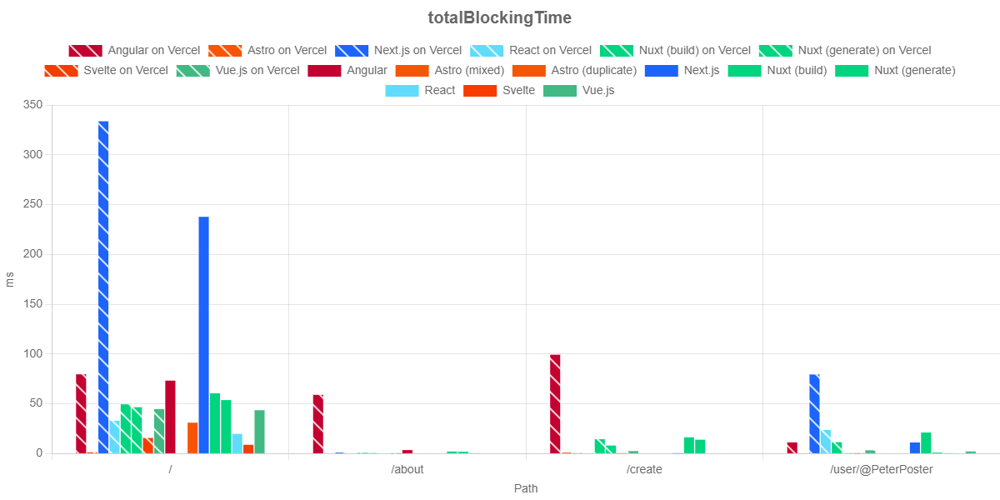

## 4.1 Page Load Time - LCP
<!-- 
- lokal schlechter
- schlecht: Angular und Next.js
-->

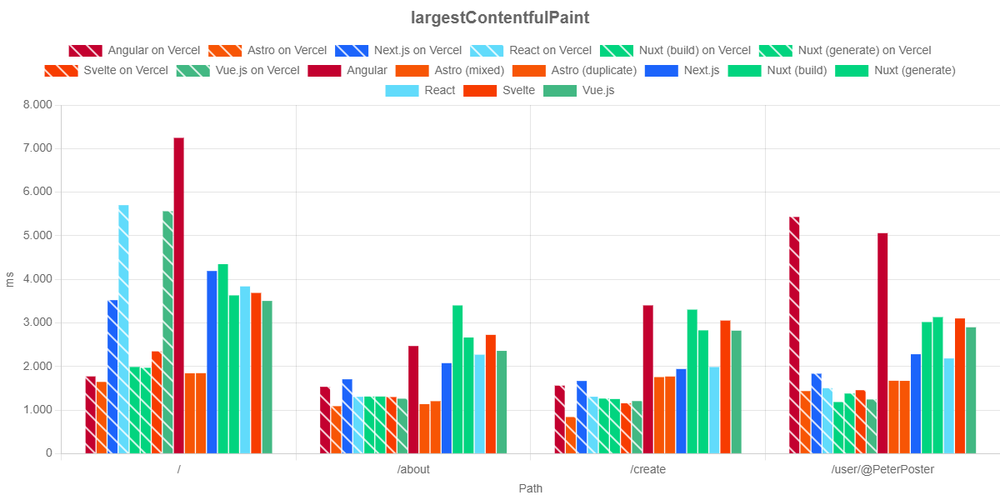

