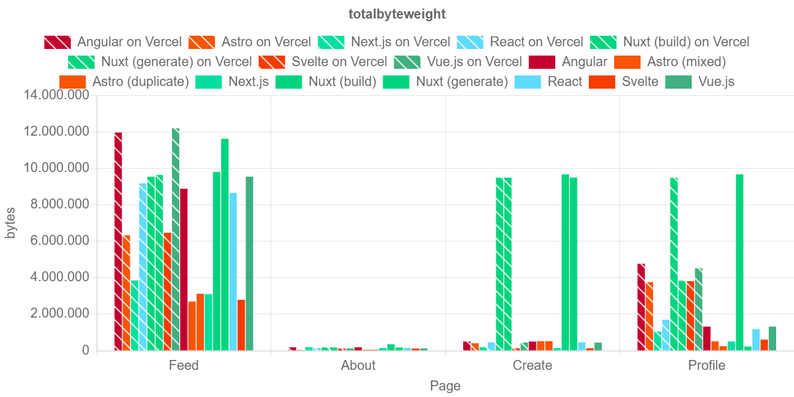
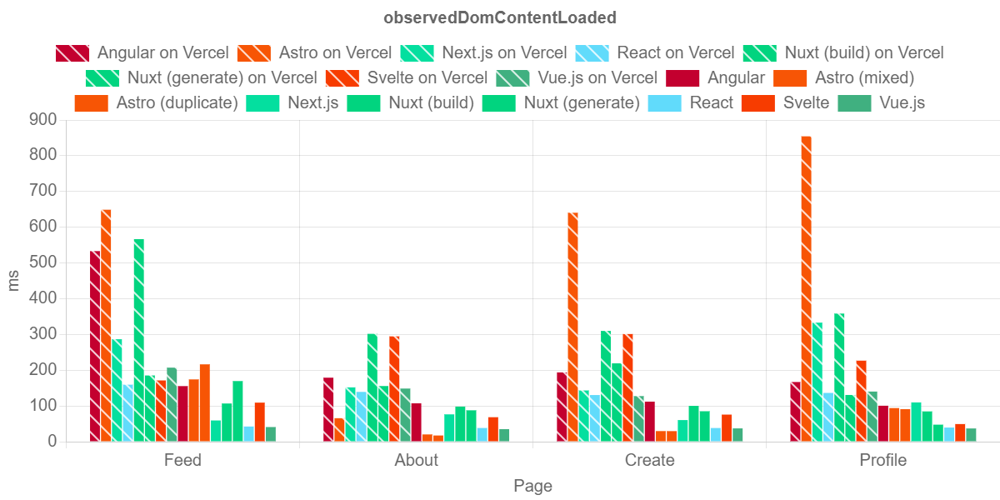
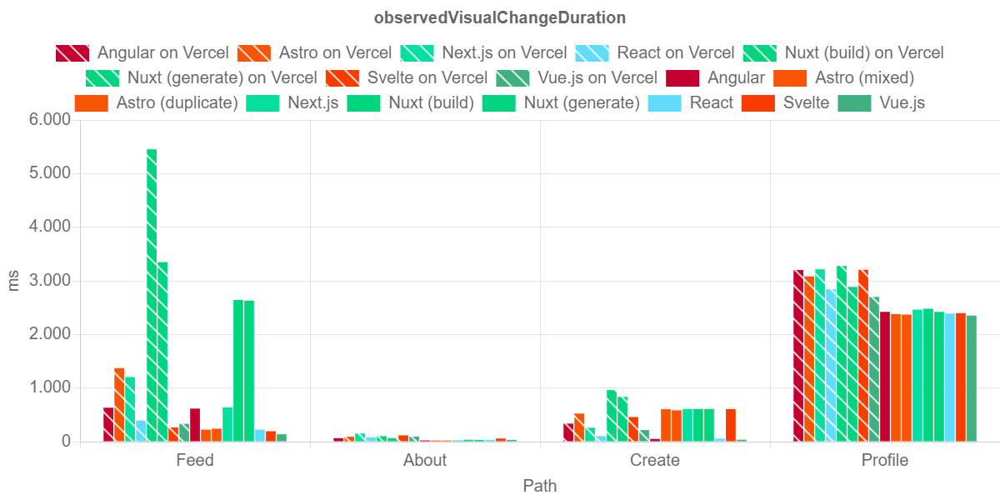

# Mega-fast or just super-fast? Performance differences of mainstream JavaScript frameworks for web applications
<!-- 
_paginate: false
_header: ""
_footer: ""
_class: lead
-->

<!-- 
Dankeschön für die Möglichkeit, hier heute meine Masterarbeit präsentieren zu können und danke, dass Sie beide die Zeit gefunden haben, auch in Präsenz hier zu sein.

Die Masterarbeit, um die es heute geht, trägt den Titel "Mega-fast or just super-fast? Performance differences of mainstream JavaScript frameworks for web applications".
Was der Titel in nicht wenigen Worten umschreibt, ist die Frage danach, wo sich Performanceunterschiede zwischen den Endprodukten von Web-Frameworks auftun, also den Webseiten, die aus der Entwicklung mit dem Framework entstehen.
 -->

Andreas Nicklaus
17.10.2024

# Agenda

<!-- 
Um den Inhalt meiner vergangenen 6 Monate gut abzudecken, möchte ich in den nächsten 30-40 Minuten über 5 Themen gehen.

Zuerst eine kurze Themenübersicht, die in das Thema einführt und die Tiefe der Betrachtung der Frameworks umreißt.
Dann möchte ich die Fragestellung für heute festhalten, soweit, dass ich sie heute beantworten kann.
Anschließend stelle ich die Strategien, wie die Frage beantwortet werden kann und gebe erklärende Worte dazu wie das Design meiner Lösungsstrategie zustande kommt.

Das mit Abstand längste Kapitel oder zumindest das mit den meisten Folien ist das der Ergebnisse. Hier sind Messwerte zum Teil graphisch aufbereitet, wo es möglich ist, und Durchschnittswerte aufbereitet, wo sie eine Aussage oder Interpretation stützen.

Abschließend werde ich noch etwa 5 Minuten damit verbringen, die Lessons Learned für weitere Arbeiten zu umreißen.

<PAUSE>
 -->

1. Themenübersicht
2. Fragestellung
3. Lösungsstrategie und -design
4. Ergebnisse
5. Lessons Learned

# 1. Themenübersicht

<!-- 
Zu allererst eine kurze Definition von Webseiten, wie sie für diese Arbeit zu verstehen sind.

<VORLESEN>

Was hier fehlt, wir jedem klar sein, der moderne Webseiten erstellt, ist dass "other factors" etwas sehr großes umfasst, dass hier fehlt und dass ist JavaScript. Kaum ein Webseite besteht heute nur noch aus HTML und CSS oder anders gesagt: Kaum ein Webseite kann heutzutage noch auf JavaScript verzichten. Daher muss ich zu dieser Definition dazu sagen, dass sie zwar stimmt, aber einen großen Teil außen vor lässt.

Was aber wichtig ist, ist, dass Webseiten entweder statisch oder dynamisch sein können. Statische Webseiten sind von Natur aus weniger komplex im Rendering sind als dynamische Seiten. Die Präsentation und Darstellung einer Webseite ist deutlich vorhersehbarer bei statischen Seiten als bei dynamischen Seiten. Daher ist auch die Performance von statischen Webseiten vorhersehbarer als bei dynamischen Seiten. Was in dieser Definition mit "user input or other factors" zusammengefasst wird, hat nachgewiesenermaßen einen großen Einfluss auf die Renderperformance der Seite.

Dieses Diagramm hier zeigt den Renderingprozess einer statischen Webseite. Was hier für eine dynamische Webseite fehlen würde, ist der Nutzer, Netzwerkgeschwindigkeit oder andere Services, die Informationen bereitstellen, wie Backend-Server, Datenbanken oder andere Web-Schnittstellen. Alleine hier wird sichtbar, dass mehrere Faktoren die Rendering-Engine des Browsers beeinflussen, bevor dem Nutzer etwas angezeigt werden kann. Hier Probleme zu erkennen bedeutet, den langsamsten Pfad zur Render-Engine zu finden. Man kann sich vorstellen, dass es bei dynamischen Seiten komplexer wird.
 -->

> Websites are made up of files written in HTML and CSS that are rendered and displayed in web browsers. They can be static, with pre-defined content, or dynamic, changing automatically based on user input or other factors. [[1](https://www.scribd.com/document/471812575/A-website)]

---

<!-- 
Für Entwickler ist die Herausforderung, Schwachstellen in der Performance der Webseite zu finden, noch komplizierter.

Einen langsamen Pfad auf der rechten Seite des Diagramms zu finden, mag möglich, wenn auch aufwendig sein, aber es ist schwieriger, weil alle Seiten und Komponenten auf der linken Seite dieses Diagramms, die in der Syntax des Frameworks definiert werden, vom Framework erst zusammengeschnürt werden. Daher ist es oft nur mit großem Aufwand möglich, einen Pfad von der linken Seite zur rechten Seite zu finden.

Entwickler, die sich in dieser Situation wiederfinden, können meist nur hoffen, dass sich in Foren im Internet ein Experte für das genutzte Framework findet, der Bescheid weiß.
Deshalb stellt sich für mich ein Frage, die sich vor mir schon viele gestellt haben: Gibt es ein "bestes Framework", bei der die Performance des Endprodukts besser ist als bei Konkurrenten?
 -->

# 2. Fragestellung

<!-- 
Oder anders formuliert: <VORLESEN>

In der Frage sind 3 Aspekte genannt, die ich kurz herausstellen will:
 -->

> Hat die Wahl des Frameworks einen für den Nutzer merklichen Einfluss auf die Render-Geschwindigkeit der Webseite?

# 2. Fragestellung

<!-- 
Erstens ist das Framework genannt. Gemeint ist dabei das Web-Entwicklungs-Framework, das der Entwickler nutzt, und nicht gemeint ist, welches Framework am einfachsten oder besten konfigurierbar ist. Stattdessen zielt die Frage auf das Framework as-is ab.   
 -->

> Hat die Wahl des Frameworks einen für den Nutzer merklichen Einfluss auf die Render-Geschwindigkeit der Webseite?

- Framework

# 2. Fragestellung

<!--
Außerdem wird hier von einem für den Nutzer merklichen Einfluss gesprochen.
Was für den Nutzer merklich ist, ist von Person zu Person natürlich unterschiedlich, aber gemeint sind hier Unterschiede von über etwa 35 Millisekunden. Alles andere ist zwar interessant, aber kaum ein umgangssprachlich merklicher Unterschied.

Außerdem muss ich hier psychologische Themen wie die Wahrnehmung und Erwartungshaltung erwähnen, da das natürlich die Bedeutung von "merklich beeinflusst". Ebenso ist die Wahrnehmung unterschiedlich für Prozesse, die schnell beginnen und lange brauchen, im Vergleich zu Prozessen, die spät beginnen, aber schnell fertig sind.
 -->

> Hat die Wahl des Frameworks einen für den Nutzer merklichen Einfluss auf die Render-Geschwindigkeit der Webseite?

- Framework
- für den Nutzer merklich

# 2. Fragestellung

<!-- 
Der dritte Aspekt der Fragestellung ist natürlich die Render-Geschwindigkeit.

Da, wie wir nachher sehen werden, der Begriff viele Facetten umfasst, muss ich hier von Tendenzen anstelle von klaren Ergebnissen sprechen.

Zum Beispiel: Ein Framework, dass Ressourcen effizient bündelt, sodass die wahrgenommene Zeit bis zum Ende des Renderings kurz ist, aber ein Webserver entsprechend länger braucht, um alle Ressourcen bereitzustellen, dann ist die Frage nach hoher Render-Geschwindigkeit nicht eindeutig beantwortbar.

<PAUSE>
 -->

>Hat die Wahl des Frameworks einen für den Nutzer merklichen Einfluss auf die Render-Geschwindigkeit der Webseite?

- Framework
- für den Nutzer merklich
- Render-Geschwindigkeit

# 3. Lösungsstrategie und -design

<!--
Um der Antwort aber näher zu kommen, habe ich für meine Arbeit 6 Dimensionen identifizieren und aufspannen können, die helfen, die Antwort auf die Frage nach dem "schnellsten Framework" zu finden, indem sie begrenzt werden.

Die erste Dimension der Forschung hier ist natürlich die Frameworks, die untereinander verglichen werden.

Die Anwendung, unter den die Frameworks getestet werden, hat ebenso einen Einfluss auf die Render-Geschwindigkeit mit ihrer Unterteilung in Seiten, wiederverwendbaren Ressourcen in Komponenten und dem Content. Deshalb muss eine vergleichbare Anwendung her.

Weil Network Delay in vorigen Arbeiten als einer der größten, wenn nicht sogar der größte Faktor, in Page Load Time identifiziert worden ist, muss auch hier klar definiert werden, wie und wo gehostet wird.

Die Werkzeuge, mit denen Tests durchgeführt werden, sind ebenso relevant, weil extra Overhead zur Bereitstellung von Ressourcen für das Testen, die Performance negativ beeinflusst.

Abschließend bildet die Wahl des oder der Browser eine Dimension, die ich zumindest vor fast 7 Monaten noch nicht in dem Ausmaß auf dem Schirm hatte wie heute.

Diese 6 Dimensionen will ich jetzt einmal durchgehen, damit anschließend die Ergebnisse meiner Experimente verständlich werden.
 -->

1. Frameworks
2. Anwendung: Seiten, Komponenten und Content
3. Hosting-Umgebung
4. Metriken
5. Test-Tools
6. Browser

## 3.1 Frameworks

<!-- 
Zuerst die Frameworks: In dieser Tabelle links stehen die genutzten Mainstream-JavaScript-Frameworks aufgeteilt nach Client Side Rendering und Server Side Rendering.

Das sind auf der Client Side Rendering Seite die zumindest für mich bekanntesten Big-3 Angular, React und Vue.js, sowie Svelte und auf der Server Side Rendering Seite mein Liebling seit etwas einem Jahr Astro und Next.js sowie Nuxt.

Die Auswahl habe ich getroffen aufgrund von Umfragewerten bezüglich vergangener Nutzung, zukünftiger Bereitschaft zur Nutzung und der generellen Neigung dem Framework gegenüber unter den Entwicklern, die das Framework schon mal benutzt haben. Dabei habe ich aber bewusst die besten Frameworks aus CSR und SSR gewählt, um eine ungefähr ausgeglichene Auswahl zu treffen.
 -->

| CSR     | SSR     |
| ------- | ------- |
| Angular | Astro   |
| React   | Next.js |
| Vue.js  | Nuxt    |
| Svelte  |         |

**Entscheidungskriterien:** [[2]](https://2023.stateofjs.com/en-US/libraries/front-end-frameworks/)
- Nutzungsquote
- Empfehlungsrate

## 3.2 Beispielanwendung

<!-- 
Damit die Frameworks untereinander verglichen werden können, bedarf es einer Webseite oder Anwendung, die mit all den Frameworks umgesetzt wurde. Weil es eine solche Anwendung noch nicht gibt, beziehungsweise mit maximal zwei von 7 Frameworks gibt, habe ich eine Anwendung entworfen, die ich im Zeitrahmen mit allen Frameworks umsetzen konnte. 

Es ist ein Klon der Mobilen App für Instagram, dich ich passenderweise NotInstagram getauft habe und besteht aus 4 Seiten: eine Startseite mit einer Profilliste und Bild- oder Videobeiträgen, eine Profilseite, mit einer Profilübersicht und einer Vorschau der Beiträge, eine "Create"-Seite mit einem Formular und einer Beitragsvorschau und eine statische Info-Seite.

Die ersten beiden Seiten sind delayed pages, also Seiten, die noch dem initialen Request für die Seiten Daten laden, um den Content in dieser Form zu präsentieren.
Die letzten beiden Seiten sind statische Seiten, also Seiten, die nach dem initialen Request alle Informationen haben, um die Seite zu präsentieren.

Die "Create"-Seite bildet für die Experimente nochmal einen Spezialfall, weil es die einzige Seite ist, die Änderungen des Contents durch Nutzereingaben ermöglicht. Sie ist somit auch die einzige echt dynamische Seite.

Wie eben kurz angesprochen ist jede Seite in Komponenten unterteilt. Die meisten sind Wrapper für Icons oder für CSS wie das "NotInstagram" Logo, das mehrmals auftaucht, aber jede Seite ist so in mehrere Sektionen unterteilt, die vom Framework als "statisch" erkannt werden und prerendered werden könnten. Sie eröffnen so auch die Möglichkeit für Performanceoptimierungen, die nicht explizit vom Entwickler konfiguriert werden.
 -->

  
  
  
  

## 3.3 Hosting-Umgebung

<!-- 
Für die Wahl der Hosting-Umgebung habe ich mich für zwei unterschiedliche Möglichkeiten entschieden.

Die erste Option für Hosting ist das Hosting bei einem Anbieter, bei dem Netzwerkverzögerung und Serverauslastung realitätsnah sind, ohne selber für eine Serververfügbarkeit oder hohe Auslastung sorgen zu müssen. Zudem sollte ein Hosting-Service Server-Side-Rendering Funktionen haben. Das schließt also reine Fileserver aus. Die Wahl ist auf Vercel gefallen, weil es zum einen mit der kostenlosen Variante auch für kleine Projekte schon realistisch einsetzbar ist, sich gut in Github und Github Actions einfügt und unter Softwareentwicklern einfach stark verbreitet ist.

Auf Vercel kann man entsprechend dann den gesamten Ladeprozess einer Webseite inklusive Netzwerkanfragen untersuchen.

Im Gegensatz dazu wurden die Anwendungen auch auf der Testmaschine lokal gehostet, um die reine Render-Geschwindigkeit ohne Netzwerkverzögerungen zu untersuchen. Gestartet wurde der jeweilige Webserver mit entweder einem Framework-spezifischen Preview-Command oder mit dem serve-Command für die Framework, wo kein solcher Command definiert ist und ein reiner Fileserver gebraucht wird.
 -->

### Vercel
- Network Delay
- Kostenloses Konto
- CI/CD Integration

### Localhost
- Reine Render-Geschwindigkeit
- `serve` oder Framework Preview
- Baseline ohne Netzwerkverzögerung

## 3.4 Metriken

<!-- 
Die Metriken, die ich für die Experimente ausgewählt habe, beschreiben ganz gut, was genau untersucht wird. Um das ein bisschen zu bündeln, habe ich den Untersuchungsgegenstand in drei Kategorien gruppiert.

Die Page Load Time umfasst, was man klassisch unter Page Load Time versteht. Die Metriken der Page Load Time beschreiben die Prozesse im Browser von Request Start hin zum Ende des DOM Content Loaded Event. Zum Ende der Page Load Time will ich am Ende noch etwas interpretieren, deshalb ist hier auf der Zeitachse das Ende nicht eingetragen.

Die Component Load Time fasst Prozesse im Browser zusammen, die passieren, nachdem der initiale Page Request beim Client angekommen ist. Netzwerkverzögerung und Server-Side Rendering Delay sind hier also explizit nicht mit inbegriffen. Die Idee ist, hier eine Baseline zu schaffen, die beschreibt, wie schnell ein Framework von der Initialisierung im Browser zu Abschluss kommt und vorerst nichts mehr am DOM verändert.

Abschließend beschreibt die Component Update Time, wie schnell das Framework auf Nutzereingaben reagiert. Wie bei der Definition am Anfang der Präsentation beschrieben, verändern sich dynamische Seiten durch User Input oder andere Faktoren.
Wir schnell diese Veränderungen an der Seite umgesetzt werden. Weil der Zeitpunkt einer Nutzereingabe oder beispielsweise eine Websocket Nachricht nicht wirklich vorhersehbar ist, ist der Start der Component Update Time auch irgendwann nach PLT und CLT eingezeichnet.
 -->

3 Kategorien zur besseren Unterteilung:

- Page Load Time (PLT)
- Component Load Time (CLT)
- Component Update Time (CUT)

---
<!-- _class: center -->
<!-- 
Ich will die Metriken für die drei Kategorien hier einmal auf die Schnelle zuweisen. Die Metriken, die nur für die Page Load Time relevant sind, sind auf dieser Folie aufgelistet.

1. Das Total Byte Weight beschreibt, wie viele Byte insgesamt für das Laden der Seite über das Netzwerk übertragen werden.
2. Tie Time To First Byte ist die Zeit zwischen dem Starten des Requests bis zum ersten empfangenen Antwortbyte.
3. DomContentLoaded beschreibt die Zeit vom Request Start bis der DOM-Content aus dem initialen Request gelesen, geparsed und geladen wurde.
4. Der Last Visual Change ist die letzte sichtbare Änderung im Viewport des Nutzers und ...
5. Der Largest Contentful Paint ist klassisch die Renderzeit des größten Elements im Viewport des Nutzers und deshalb oft ausschlaggebend für die empfundene Ladezeit einer Seite. 
 -->

|                          |  PLT  | CLT | CUT |
| ------------------------ | :---: | --- | --- |
| Total Byte Weight        |   x   |     |     |
| Time To First Byte       |   x   |     |     |
| DomContentLoaded         |   x   |     |     |
| Last Visual Change       |   x   |     |     |
| Largest Contentful Paint |   x   |     |     |

---
<!-- _class: center -->
<!-- 
1. Die Time To Interactive beschreibt die Zeit vom Request Start bis der DOM als "interactive" gekennzeichnet wird.
2. Die Total Blocking Time beschreibt eine berechnete Zeit, in der der Nutzer von Nutzereingaben abgehalten wird, weil beispielsweise Code ausgeführt oder Dateien geparsed werden.
3. LoadEventEnd beschreibt die Zeit zwischen dem Request Start und dem Ende des OnLoad Events des DOM.

Diese 3 sind sowohl für Page Load Time als auch für Component Load Time relevant.

4. Observed First Visual Change und Observed Last Visual Change beschreiben die Zeit vom Request Start bis zur ersten, bzw. letzten visuellen Änderung im Viewport des Browsers.
5. DOM Mutation Times sind keine bekannte Metrik. Gemessen werden hier alle Zeiten von DOM Mutations innerhalb eines Framework-spezifischen HTML Root-Elements. Für Component Load Times sind es von Anfang des DOM-Renderings an alle Mutations und für Component Update Times werden bloß Mutations nach User Input gemessen.
 -->
|                              |  PLT  |  CLT  |  CUT  |
| ---------------------------- | :---: | :---: | :---: |
| Time To Interactive          |   x   |   x   |       |
| Total Blocking Time          |   x   |   x   |       |
| LoadEventEnd                 |   x   |   x   |       |
| Observed First Visual Change |       |   x   |       |
| Observed Last Visual Change  |       |   x   |       |
| DOM Mutation Times           |       |   x   |   x   |

## 3.5 Test-Tools

<!-- 
Um für all diese Metriken zu messen, habe ich 2 Tools genutzt.

Wahrscheinlich die erste Station und seit einiger Zeit State of the Art für Web Performance Tests ist Lighthouse, weil es eine sehr umfangreiche Sammlung an Metriken bietet. Das Command Line Interface erlaubt die Automatisierung von Tests. Es ist technisch möglich, Tests mit Lighthouse auch in anderen Browsern auszuführen, aber da Lighthouse ein Google-Produkt ist und für Google Chrome vorgesehen ist, habe ich die Test nur in einem headless Google Chrome ausgeführt.

Ebenso, aber mit ein bisschen mehr Aufwand betrieben wird Playwright. Primär ist Playwright vorgesehen, um Content und Interaktionen zu überprüfen, aber mit Custom Test lassen sich beliebige Skripte im Browserfenster ausführen, um Metriken zu sammeln. Diese Injektion von Skripten bedeutet in diesem Fall, dass es möglich ist, die Frameworks als Black Box zu testen und Testskripte müssen nicht Teil des Entwicklungsaufwands für die Anwendung sein.

Playwright erlaubt zudem auch noch die Wahl des Browsers, in dem die Anwendung für Messungen geöffnet wird.
 -->

### Lighthouse CLI
- State of the Art für Web-Performance
- Umfangreiche Sammlung an Metriken
- Automatisierung von Tests
- Google Chrome

### Playwright
- Tests für Content und Interaktionen
- Custom Tests
- Injektion von Skripts 
  ➡️ Black-Box-Testing
- Freie Browser-Wahl

---

<!-- _class: center -->
<!-- 
Diese Aufteilung der Metriken auf die Test-Tools zeigt, dass Aggregat-Metriken von Lighthouse abgedeckt werden und Playwright Metriken abdeckt, die entweder aus dem Browser-Window-Kontext ausgelesen werden können oder Custom Metriken für diese Arbeit sind. 
 -->

| Lighthouse                          | Playwright       |
| ----------------------------------- | ---------------- |
| Total Byte Weight (TBW)             | DomContentLoaded |
| Time To First Byte (TTFB)           | loadEventEnd     |
| Time To Interactive (TTI)           | Mutation Times   |
| Total Blocking Time (TBT)           |                  |
| Largest Contentful Paint (LCP)      |                  |
| Observed First Visual Change (OFVC) |                  |
| Observed Last Visual Change (OLVC)  |                  |

## 3.6 Browser

<!-- 
Die letzte Dimension für die Performance von Webanwendungen, die von dieser abgedeckt wird, ist der genutzte Browser. Test in Lighthouse werden wie gesagt nur in Google Chrome ausgeführt, aber Playwright erlaubt die Wahl eines oder mehrerer Browser.

Aufgrund der Verbreitung der Browser, ist die Wahl auf diese 7 gefallen:

<VORLESEN>
<PAUSE>
 -->

- Google Chrome
- Mobile Chrome
- Chromium
- Microsoft Edge
- Firefox
- Desktop Safari
- Mobile Safari

# 4. Ergebnisse

<!-- 
Wenn wir uns jetzt die Ergebnisse genau angucken, muss ich zum besseren Verständnis eine Erkenntnis aus den Ergebnissen vorwegnehmen, damit wir mit den richtigen Augen darauf gucken.

1. Für die Page Load Time und Component Load Time sind die Messergebnisse unschlüssig. Die Messwerte sind schlicht nicht eindeutig genug, um die Frage nach den besten Framework zu beantworten, weil verschiedene Metriken zum einen untereinander widersprüchlich sind, weil sie die unterschiedlichen Stärken und Schwächen der Frameworks aufzeigen und undeutlich sind, ob es technologische Bestlösungen wie zum Beispiel bzgl. Client-Side und Server-Side Rendering gibt.

2. Die Component Update Times werden vergleichsweiße einfach interpretiert. Sowohl die Spannweite als auch die Zeiten von DOM Mutations zeigen Tendenzen bzgl. schneller Browser und Frameworks auf.

Mit diesem Vorwissen will ich jetzt über die Ergebnisse fliegen.
 -->

- Unschlüssig für PLT und CLT
  - Ungleich verteilte Stärken und Schwächen der Frameworks
  - Undeutliche Tendenzen bzgl. Client-Side vs. Server-Side Rendering
- Undeutlich für CUT
  - Unterschiedliche Spannweiten und Zeiten der DOM Mutations
  - Durchschnittsranking von Frameworks und Browsern möglich

## 4.1 Page Load Time - TTFB
<!-- 
Die Time To First Byte zeigt auf den ersten Blick, dass Anfragen unabhängig vom Framework schneller beantwortet werden, wenn die Anwendung lokal gehostet werden.

Ausreißer nach oben sind anhängig von der Seite von Astro, Angular, Next.js und Nuxt zu sehen. 
 -->

## 4.1 Page Load Time - TBW
<!-- 
Die Total Byte Weight der Anwendungen zeigt große Unterschiede unter den Frameworks auf. Während Next.js, Astro und Svelte generell eine geringe Byte Weight haben, haben Angular und Vue.js auf der Feed Seite und Nuxt sonst eine relativ hohe Byte Weight.
 -->

## 4.1 Page Load Time - TTI
<!-- 
Die Time To Interactive zeigt überraschenderweise eine Tendenz dahin, dass lokal gehostete Anwendungen länger bis zum state interactive brauchen.

Unter den Frameworks zeichnet sich Astro als das Schnellste ab, Nuxt ist durch die Bank relativ langsam und React und Svelte weisen eine große Abhängigkeit vom Hosting oder von Seite auf.
 -->

## 4.1 Page Load Time - DomContentLoaded
<!-- 
Das Timing von DomContentLoaded zeigt im Gegensatz dazu, dass lokales Hosting hier schneller ist. React und Vue sind generell schneller als andere Frameworks. Astro zeigt hier eine Schwäche, abhängig davon, ob die Seite statisch ist oder nicht.
 -->

## 4.1 Page Load Time - TBT
<!-- 
Die Total Blocking Time zeigt, dass das Hosting irrelevant ist. Astro und Next.js performen hier am schlechtesten.
 -->

## 4.1 Page Load Time - LCP
<!-- 
Das Largest Contentful Paint ist ebenso lokal schlechter. Angular und Next sind hier wieder schlechter.
 -->

## 4.1 Page Load Time - OLVC
<!-- 
Der OLVC weist zwei Sachen auf:

1. Zum einen starke Ausreißer von Nuxt auf der Feed Seite und 
2. Verzögerungen durch die Nutzung von Chained Async Funktionen.

Auf der Profile Seite wird erst ein Service zum Laden von Nutzerdaten und dann ein Service zum Laden von Posts genutzt.
 -->

## 4.2 Component Load Time - LoadEventEnd
<!-- 
Ergebnisse für die Component Load Time sind vergleichsweise interessant.

Das LoadEventEnd beinhaltet Ausreißer mit Astro und Svelte, insbesondere in Firefox.

Beim genaueren Untersuchen wird dann auch klar warum.
 -->

## 4.2 Component Load Time - balanced LoadEventEnd (1)
<!-- 
Aus einem mir bis heute unerfindlichen Grund werden Request bei der Verwendung von Playwright in Firefox teilweise einfach verzögert gemacht.

Deswegen habe ich mir als Lösung eine Metrik namens balanced loadEventEnd ausgedacht, die von der Zeit die Zeit des requestStart abzieht, um das auszugleichen.

Das hier ist die wirklich unkomplizierte Formel dafür.
 -->
In Firefox werden Requests teilweise erst verspätet gemacht. Das balanced LoadEventEnd nur misst die Zeit nach dem Requeststart.

$$\mathit{loadEventEnd}_\mathit{balanced} = \mathit{loadEventEnd}_\mathit{raw} - \mathit{requestStart}$$

## 4.2 Component Load Time - LoadEventEnd
<!-- 
Den Unterschied in Ergebnissen sehen wir dann hier. Das sind die alten Messwerte.
 -->

## 4.2 Component Load Time - balanced LoadEventEnd (2)
<!-- 
... und das sind die angeglichenen Werte.

Den einzigen aber dafür großen Unterschied sieht man in Firefox.

Was bleibt sind schlechte Werte von Angular in Chromium, Mobile Chrome, Microsoft Edge und Google Chrome und von Astro in Desktop Safari und Mobile Safari.

Die anderen Frameworks sind dahingehen deutlich besser.
 -->

## 4.2 Component Load Time - OFVC
<!--
Die Observed First Visual Change hat mehrere Outlier, aber viel ich finde es deutlicher und überraschender, dass lokal gehostet so viel besser ist, weil sich das beim Observed Last Visual Change nicht mehr zeigt.

Deswegen habe ich mir die Observed Visual Change Duration ausgedacht.
 -->

## 4.2 Component Load Time - OVCD
<!-- 
Die Zeit zum First Visual Change und Last Visual Change beinhalten auch die Zeit, die der erste Request für die Seite braucht. Die Zeit zwischen den beiden Metriken beschreibt deutlich weniger Netzwerkverzögerung und mehr die Render-Geschwindigkeit im Browser.

Die wiedermal einfache Gleichung dafür sehen Sie hier.
 -->
First und Last Visual Change umfassen auch die Datenübertragungs-zeit. Die Observed Visual Change Duration beschreibt die Zeit zwischen Anfang und Ende der visuellen Änderungen.

$$\mathit{observedVisualChangeDuration} = \mathit{OLVC} - \mathit{OFVC}$$

## 4.1 Page Load Time - OLVC
<!-- 
Das hier ist nochmal der OLVC und...
 -->

## 4.2 Component Load Time - OVCD
<!-- 
Das Ergebnis sehen wir hier.

Die Idee des Observed Visual Change Duration hat also offensichtlich nicht viel gebraucht. Die Idee könnte also noch ausgebessert werden. 
 -->

## DOM Mutation Times
<!-- _class: lead -->
<!-- 
Die letzte Verbleibende Metrik sind die DOM Mutation Times. Diese DOM Mutations können beim Laden der Seite und nach User Interaction gemessen werden. Deshalb sind sie sowohl für die Component Load Time als auch für Component Update Times relevant.
 -->

- Component Load Times

- Component Update Times

---

<!-- 
Die Aufzeichnung der DOM Mutations erfolgt über eine mit Playwright injektetes Skript. Dieses Skript sucht in einem Intervall nach einem Framework-spezifischen Root-Element für die Anwendung und initialisiert einen MutationObserver darauf.

Jede Mutation wird mit der ID und xpath des Element sowie der Zeit seit Initialisierung gespeichert und im Window-Kontext des Browsers veröffentlicht, damit es später ausgelesen werden kann.
 -->

### Aufzeichnung

---
<!-- 
Genutzt werden diese Aufzeichnungen in zwei Fällen.

1. Beim Laden der Seite wird erst das Skript injected und dann die Seite geladen. Dabei wird automatisch jede Mutation aufgezeichnet. Nach einer ausreichenden Zeit, hier 10 Sekunden, werden die Ergebnisse ausgewertet.
Als Ergebnis können dann die Zeiten ausgewertet werden, um sicherzustellen, dass keine Mutation lange dauern.

2. Für User Interactions passiert der gleiche Prozess, aber nach dem Laden der Seite werden die Aufzeichnungen zurückgesetzt. Erst anschließend wird die Interaktion ausgeführt und die Aufzeichnungen werden gelesen.
 -->

### Nutzung

## 4.2 Component Load Times - DOM Mutations
<!-- 
Was dabei für die Component Load Times rauskommt sehen wir hier:

Scheinbar sind Next.js und Svelte deutlich langsamer als andere Frameworks, besonders in Safari-Browsern.

Außerdem zeichnet sich ab, dass manche Browser hier langsamer das DOM updaten als andere.

Und zu guter letzt fällt auf, dass insbesondere in den "schnelleren" Browsern Aufzeichnungen für manche Framework komplett fehlen, sowie es eine Aufzeichnungsgrenze bei etwa 100 ms gibt.
Das kann man folgendermaßen erklären...
 -->

## 4.2 Component Load Times - DOM Mutations
<!-- 
Es gibt zwei zeitlich Aufzeichnungsgrenzen, die aus der Initialisierung des Mutation Observer und dem Ende der Testzeit entstehen.

1. Es kann passieren, dass es bis zu 100 ms dauert, bis das Root-Element für den Mutation Observer gefunden wird, weil es nur alle 100 ms gecheckt wird, ob es existiert. Deshalb dauert es mitunter so lange, bis Mutations aufgezeichnet werden können.
2. Nach 10 Sekunden wird das Aufzeichnen abgebrochen.

Deshalb können schnelle DOM Mutations direkt nach dem Laden der Seite und ganz späte Mutations nicht aufgezeichnet werden. 
 -->
- Zwei Aufzeichnungsgrenzen
  - Initialisierungsintervall von 100 ms
  - festes Ende nach 10 s
- Fehlende Aufzeichnungen
  - Schnelle Updates nach Laden des DOMs
  - Langsame Updates nach Ende der Aufzeichnung

## 4.3 Component Update Times
<!-- 
Für die Component Update Times habe ich 4 User Actions definiert, die auf der About Seite durchgeführt werden.

Alle füllen jeweils Teile des Formulars aus und erwartete Änderungen sind am Formular und an der unteren Hälfte der Seite, der Vorschau eines Posts.

- Die erste User Action schreibt einen Text als Caption für den Post, ...
- die zweite wählt eine Option für ein Bild aus einem Dropdown-Menü aus, ...
- die dritte schreibt eine URL in ein Textfeld als Quelle für ein Bild und ...
- die vierte schreibt sowohl ein Caption als auch wählt eine Bildquelle aus dem Dropdown-Menü aus.
 -->

1. Caption Insert
2. Media Selection
3. Source Insert
4. Post Creation (1. & 2.)

## 4.3 Component Update Times
<!-- 
Die aufgezeichneten Zeiten für die DOM Mutations sehen wir hier.

3 Dinge fallen besonders auf:

1. Nuxt schneidet durch die Bank weg am schnellsten ab. Mit Nuxt passieren unabhängig vom Browser keine DOM Mutations über 200 ms nach der Nutzerinteraktion.
2. Next.js ist anscheinend das langsamste Framework, aber ist bloß wirklich langsam in Firefox, Mobile Safari und Desktop Safari.
3. Unter den Browsern sind Chromium, Mobile Chrome, Google Chrome und Microsoft Edge die schnellsten, was darauf hinweist, dass die Render-Engine Blink hier einen großen Einfluss spielt.

<PAUSE>
 -->

## 4.3 Component Update Times - Messungen
<!--
_class: table-sm
-->
<!-- 
Für die Zahlenverliebten habe ich nochmal die minimalen, maximalen und durchschnittlichen Zeiten pro Framework und Browser aufgelistet.

Die rot markierten Zellen sind die schlechtesten Minimalwerte, Maximalwerte und Durchschnittswerte.
Diese werden von Desktop Safari in Kombination mit Astro und Next.js gehalten.

Das hier sind die langsamsten drei Browser. Es wird klar, dass sich hier bestätigt, was wir davor schon gesehen haben:

1. Nuxt ist einer der schnellsten Frameworks, wenn auch nicht immer der schnellste und Next.js ist das langsamste Framework.
 -->

|                |    Nuxt | Angular |  Vue.js |   React |                   Astro |  Svelte |                      Next.js |       Ø |
| -------------- | ------: | ------: | ------: | ------: | ----------------------: | ------: | ---------------------------: | ------: |
|                |      51 |      77 |      47 |      84 | 
87
 |      70 |                           79 |      71 |
| Desktop Safari |  **86** | **123** | **136** | **169** |                 **170** | **164** | 
**304**
 | **164** |
|                |     124 |     172 |     200 |     280 |                     270 |     283 |     
493
 |     260 |
|                |         |         |         |         |                         |         |                              |         |
|                |      47 |      52 |      52 |      67 |                      78 |      56 |                           73 |      61 |
| Mobile Safari  | **110** | **106** | **133** | **126** |                 **154** | **126** |                      **196** | **136** |
|                |     167 |     152 |     206 |     183 |                     254 |     208 |                          372 |     220 |
|                |         |         |         |         |                         |         |                              |         |
|                |      59 |      54 |      52 |      54 |                      63 |      60 |                           59 |      57 |
| Firefox        |  **83** |  **89** |  **82** |  **84** |                  **99** |  **94** |                      **142** |  **96** |
|                |     108 |     123 |     103 |     181 |                     142 |     129 |                          235 |     146 |

## 4.3 Component Update Times - Messungen
<!-- 
Bei den nächst-schnelleren zwei Browsern zeigt sich wieder das ein ähnliches Bild, aber hier sind die mittleren Plätze auf dem Podium deutlich umkämpfter und die Frameworks ungefähr gleich.  
 -->
<!-- 
_class: table-sm
-->

|               |   Nuxt | Angular | Vue.js |  React |  Astro | Svelte | Next.js |      Ø |
| ------------- | -----: | ------: | -----: | -----: | -----: | -----: | ------: | -----: |
|               |     42 |      44 |     46 |     44 |     49 |     45 |      47 |     45 |
| Mobile Chrome | **61** |  **67** | **69** | **67** | **69** | **81** |  **94** | **73** |
|               |     82 |      90 |     89 |     82 |     85 |    116 |     143 |     98 |
|               |        |         |        |        |        |        |         |        |
|               |     39 |      44 |     51 |     44 |     51 |     38 |      47 |     45 |
| Chromium      | **66** |  **69** | **77** | **58** | **71** | **74** |  **75** | **70** |
|               |     94 |      95 |    104 |     85 |     89 |     95 |     108 |     96 |

## 4.3 Component Update Times - Messungen
<!-- 
Die Browser mit den niedrigsten Durchschnittswerten sind hier abgebildet: Microsoft Edge und Google Chrome.

Die grün hinterlegten Werte sind die niedrigsten Minimalwerte, Maximalwerte und Durchschnittswerte.
Google Chrome hält diese mit Nuxt und Astro. Astro ist überraschend, weil der langsamste Minimalwert auch schon mit Astro erreicht wurde.
 -->
<!-- 
_class: table-sm
-->

|                |                    Nuxt | Angular | Vue.js |  React |                       Astro | Svelte | Next.js |      Ø |
| -------------- | ----------------------: | ------: | -----: | -----: | --------------------------: | -----: | ------: | -----: |
|                |                      37 |      43 |     40 |     41 |                          44 |     40 |      46 |     42 |
| Microsoft Edge |                  **61** |  **70** | **61** | **62** |                      **64** | **74** |  **73** | **67** |
|                |                      85 |      90 |     79 |     75 |                          80 |    102 |     134 |     93 |
|                |                         |         |        |        |                             |        |         |        |
|                | 
34
 |      41 |     37 |     40 |                          43 |     39 |      41 |     39 |
| Google Chrome  |                  **60** |  **62** | **61** | **59** | 
**57**
 | **64** |  **69** | **62** |
|                |                      77 |      84 |     77 |     77 |     
72
 |     89 |      99 |     82 |

## 4.3 Component Update Times - Messungen
<!-- 
Der Durchschnitt über alle Browser zeigt ein mehr oder weniger klares Ranking der Frameworks.

Der reine Browser Average zeigt Nuxt auf Platz 1, Angular auf Platz 2, Vue.js und React hart umkämpft um den Platz 3, Astro und Svelte hart umkämpft um den Platz 5 und Next.js deutlich auf dem letzten Platz.

Der Weighted Browser Average ist gewichtet nach dem Anteil an Nutzung der Browser weltweit.
Auch hier ist Nuxt auf Platz 1, Angular und Vue.js sind nah beieinander um Platz 2, React und Astro könnten sich den 4. Platz teilen, Svelte ist auf Platz 6 und Next.js wiederum mit Abstand auf dem letzten Platz.  
 -->
<!-- 
_class: table-sm
-->

|                          |   Nuxt | Angular | Vue.js |  React |  Astro | Svelte | Next.js |
| ------------------------ | -----: | ------: | -----: | -----: | -----: | -----: | ------: |
|                          |     44 |      51 |     46 |     53 |     59 |     50 |      56 |
| Browser Average          | **75** |  **84** | **88** | **89** | **98** | **97** | **136** |
|                          |    105 |     115 |    123 |    138 |    142 |    146 |     226 |
|                          |        |         |        |        |        |        |         |
|                          |     35 |      45 |     36 |     45 |     48 |     42 |      45 |
| Weighted Browser Average | **60** |  **69** | **70** | **75** | **74** | **78** | **107** |
|                          |     80 |      94 |     93 |    110 |    104 |    118 |     167 |

## 4.3 Component Update Times - Ranking
<!-- 
Daraus ergeben sich folgende Rankings für Frameworks und Browser:

<VORLESEN>
 -->

### Frameworks
1. Nuxt
2. Angular
3. Vue.js
4. React
5. Astro / Svelte
7. Next.js

### Browsers
1. Google Chrome
2. Microsoft Edge
3. Chromium
4. Mobile Chrome
5. Firefox
6. Mobile Safari
7. Desktop Safari

# 5. Lessons Learned
<!-- 
Zum Abschluss für heute gibt es jetzt nochmal eine Zusammenfassung der Lessons Learned, die man nach Hause mitnehmen kann.

Dafür will ich einmal ein paar kritische Worte zu den Ergebnissen, meiner Herangehensweise an die Fragestellung und den von mit entwickelten Test-Ansätzen für DOM Mutationen sagen.
 -->
1. Ergebnisse
2. Methodik
3. Test-Ansatz für DOM-Mutationen

## 5.1 Ergebnisse
<!-- 
Wie wir gesehen haben, sind die Testergebnisse der Arbeit nicht ausreichend, um bzgl. Page Load Time oder Component Load Time eine zuverlässige Aussage bzgl. "bestem" Framework zu treffen.

Die Component Update Times zeigen Tendenzen auf, die eine zumindest teilweise eine Aussage zulassen, ob überhaupt ein Performanceunterschied auffindbar ist.

Diese Tendenzen beziehen sich auf Zeiten von 69-107 ms unter den Frameworks und 62-164 ms unter den getesteten Browsern. Diese Unterschiede sind merklich, aber ich würde sogar sagen, dass sie nah an der Grenze zum unmerklichen sind.

Ich hatte persönlich natürlich auf extremere Unterschiede gehofft, aber sogar auch eine größere Range unter den Frameworks erwartet.
 -->
- Testergebnisse sind **nicht eindeutig** bzgl. Page Load Times und Component Load Times.
- Component Update Times zeigen **undeutliche Tendenzen** auf.

**CUT:**
- Frameworks: Ø 69 - 107 ms 
- Browsers: Ø 62 - 164 ms

## 5.2 Methodik
<!-- 
An meiner Herangehensweise an die Fragestellung haben sich Lücken im Laufe der Arbeit gezeigt, die ich hier selbstkritisch aufzeigen will.

Insbesondere mit Lighthouse schwanken die Messergebnisse teilweise zwischen Test Runs um bis zu 30%. Wenn es sonst nichts zuverlässiges beweist, dann zumindest dass die Verteilung der Messwerte breiter ist als wir es als daten-fokussierte Informatiker gerne hätten.

Diese Verteilung könnte bei genauerer Betrachtung unerwartete Performanceunterschiede aufzeigen, die noch nicht zu erkennen sind, gerade weil ich festgestellt habe, dass es hier um Tendenzen als um klare Vorteile geht. Um so Erkenntnisse zu erlangen, müsste aber viel mehr Daten gesammelt werden.

Der Testumfang könnte definitiv am getesteten Inhalt ausgeweitet werden bzgl. Seiten und Seitenarten, Komponenten, insb. Komponenten mit komplexeren und daten-intensiveren Funktionen, anderen Hosting Möglichkeiten und mehr Test Runs und Test Runs bspw. zu unterschiedlichen Tageszeiten.
 -->
- Messergebnisse schwanken um bis zu 30%
- Verteilung der Ergebnisse könnte Performanceunterschiede aufzeigen
- Testumfang muss ausgeweitet werden
  - Seiten
  - Komponenten
  - Hosting Services
  - Test Runs

## 5.3 Test-Ansatz für DOM-Mutationen
<!-- 
Zu den entwickelten Tests wurden auch Kritikpunkte gefunden, die definitiv noch verbesserbar sind.

1. Aufzeichnung fehlen von DOM Mutations am Anfang und Ende der Tests. Deshalb fehlt Information, die zur Interpretation der Ergebnisse nicht ganz unwichtig sein könnten. Um dieses Problem zu lösen fällt mir nur ein, den Black-Box-Testing-Ansatz abzulegen und mit White-Box-Testing fortzufahren.
2. Mit White-Box-Testing könnten notwendige Events in die Anwendung integriert werden, die den Start von Rendering triggern oder ein Rendering-Ende signalisieren.

Zu guter Letzt kann ich noch selbstkritisch anmerken, dass alle Tests, die ich für diese Arbeit durchgeführt habe, die Navigation zwischen Seiten komplett außen vorlassen. Insbesondere Apps die Preloading von Seiten integrieren oder Dateien bündeln, die für mehr als nur die aktuelle Seiten relevant sind, könnten hier dann besser abschneiden.

<PAUSE>
 -->
- Aufzeichnungen von DOM-Mutationen fehlen am Anfang und Ende der Tests
- White-Box Testing, um...
  - Aufzeichnungen zu triggern und...
  - Rendering-Ende zu signalisieren

- keine Tests zu Navigation zwischen Seiten

# Dankeschön!
<!-- 
_paginate: false
_header: ""
_footer: ""
_class: lead
-->
<!-- 
Das war's von meiner Seite, was ich vorbereitet habe. Wenn noch Antworten ausgeblieben sind, die ich nicht vorbereitet habe, würde ich sie jetzt sehr gerne geben.
 -->
**Mega-fast or just super-fast? Performance differences of mainstream JavaScript frameworks for web applications**

Andreas Nicklaus, 44835

17.10.2024

# Referenzen

[1] https://www.scribd.com/document/471812575/A-website
[2] https://2023.stateofjs.com/en-US/libraries/front-end-frameworks/